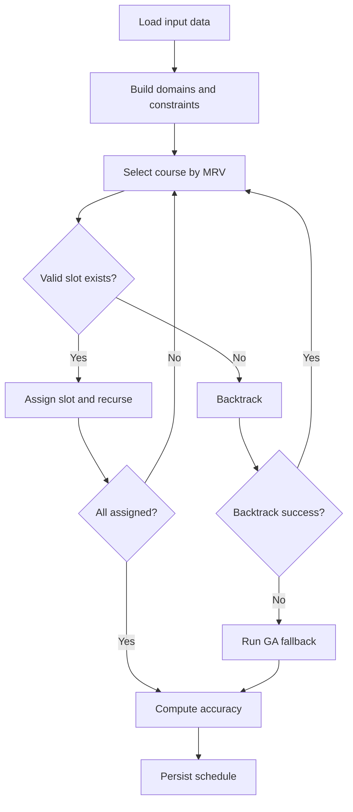
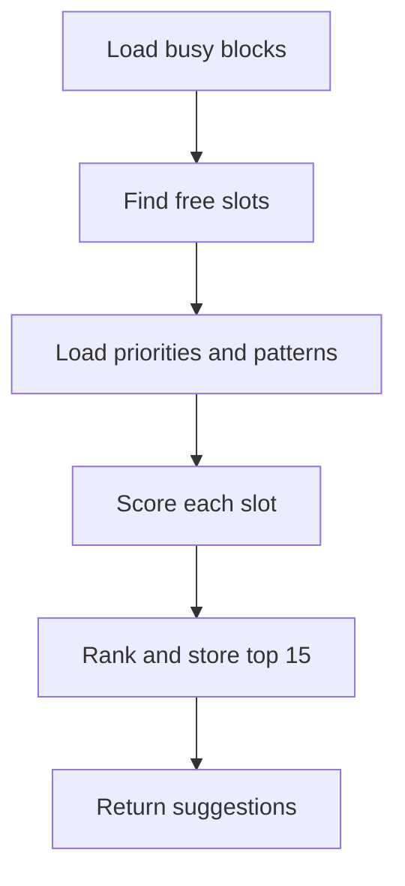
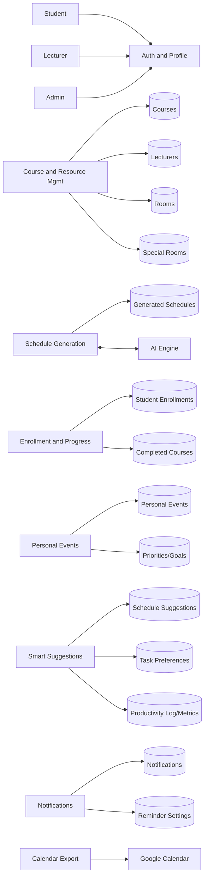
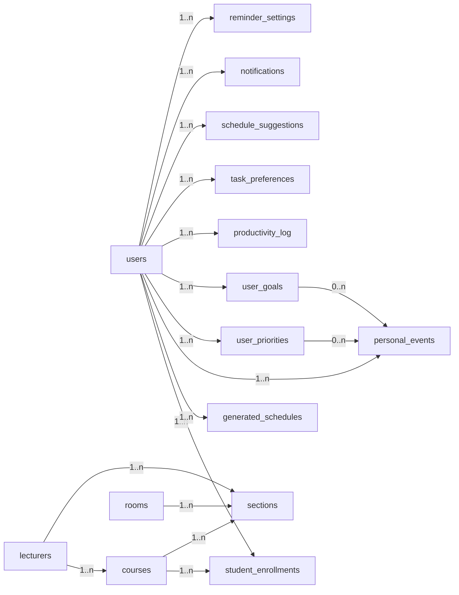
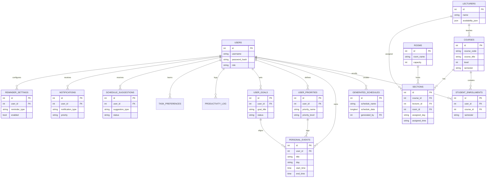
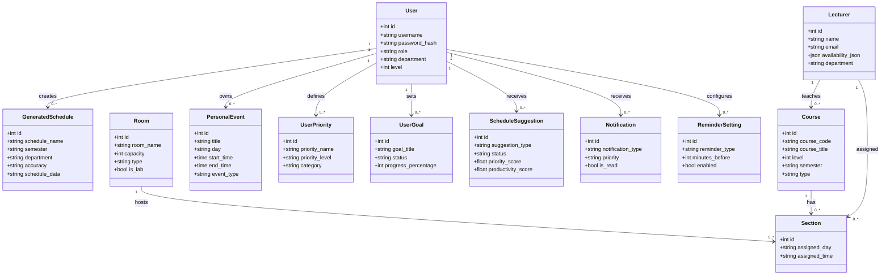

# Chapter 5 - Detailed Design of the Proposed System

## 5.0 Functional Processes of the Proposed System

1. Authentication and role management
   - Users authenticate through the web UI.
   - Role (super_admin, faculty_admin, lecturer, student) drives access to features and data scopes.

2. Course and resource setup (admin)
   - Admins maintain courses, lecturers, rooms, and special room mappings.
   - Lecturer availability and constraints are recorded for scheduling.

3. Timetable generation (admin)
   - Admin triggers generation.
   - Python AI engine runs CSP-based scheduling with learned historical weights.
   - Result is persisted as JSON into `generated_schedules`.

4. Schedule consumption (students and lecturers)
   - Students view weekly schedule by enrolled courses.
   - Lecturers view weekly schedule by their assigned sections.

5. Enrollment and progress tracking (students)
   - Students enroll/unenroll in courses.
   - Completed courses are tracked to refine suggestions and progress views.

6. Personal event management
   - Users add personal events linked to a priority or goal.
   - Conflicts are checked against existing personal events.

7. AI smart suggestions
   - Busy blocks are derived from courses and personal events.
   - Free slots are scored by priority, productivity patterns, and learned preferences.
   - Suggestions are stored in `schedule_suggestions` and displayed for accept/reject feedback.

8. Notifications and reminders
   - Reminders are generated for courses, exams (placeholder), and personal events.
   - Notifications are stored and surfaced in the UI with unread status.

9. Calendar export
   - Scheduled classes and personal events are combined.
   - A Google Calendar event link is produced for the current week.

10. Analytics
   - Productivity logs are aggregated into metrics.
   - Heatmaps and statistics are shown on the analytics page.

---

## 5.1 Algorithm and Flowchart of the Processes

### 5.1.1 Core Timetable Generation (AI Scheduler)

Algorithm overview (CSP + learning):

1. Load courses, lecturers, rooms, availability, and constraints.
2. Build the constraint model (room, lecturer, level, special rooms).
3. Use MRV heuristic and backtracking to assign slots.
4. Rank candidate slots using historical scores and soft preferences.
5. If CSP times out or fails, invoke genetic algorithm fallback.
6. Compute schedule accuracy and persist results.

Pseudocode:

```
Input: courses, lecturers, rooms, constraints, historical_model
Output: feasible schedule

build_domains(courses, rooms, time_slots)
apply_hard_constraints(domains)
order_variables_by_MRV(courses)

function backtrack(assignments):
    if all courses assigned:
        return assignments
    course = select_unassigned_course()
    for slot in order_by_historical_score(course, domains[course]):
        if consistent(course, slot, assignments):
            assign(course, slot)
            if backtrack(assignments):
                return assignments
            unassign(course)
    return failure

schedule = backtrack({})
if failure:
    schedule = genetic_algorithm_fallback()
score = compute_accuracy(schedule)
persist(schedule, score)
return schedule
```

Flowchart:



### 5.1.2 Smart Suggestions (Personal Scheduler)

Algorithm overview:

1. Gather busy blocks from enrolled courses and personal events.
2. Compute free slots for each day.
3. Score slots using priorities, productivity history, and learned preferences.
4. Persist top-N suggestions.

Pseudocode:

```
Input: busy_blocks, priorities, productivity_patterns, task_preferences
Output: ranked suggestions

free_slots = find_free_slots(busy_blocks)
for slot in free_slots:
    slot.score = score(slot, priorities, productivity_patterns, task_preferences)
return top_n(sort_by_score(free_slots))
```

Flowchart:



---

## 5.2 Data Flow Diagrams

### Level 0 (Context Diagram)

```mermaid
flowchart LR
    Student[Student] -->|Login, Enroll, Events, Feedback| System[VVU Scheduler]
    Lecturer[Lecturer] -->|Login, View schedule| System
    Admin[Admin] -->|Manage data, Generate schedule| System
    System -->|Weekly schedule, Suggestions, Notifications| Student
    System -->|Weekly schedule| Lecturer
    System -->|Reports, Logs| Admin
    AI[AI Engine] <--> |Schedule generation| System
    Calendar[Google Calendar] <..>|Export link| System
```

### Level 1 (Decomposition)



---

## 5.3 Data Dictionary

### Database Schema Summary

Core academic scheduling tables:
- users, lecturers, courses, rooms, sections, schedules, generated_schedules, student_enrollments, special_rooms

Personal scheduler tables:
- personal_events, user_priorities, user_goals, schedule_suggestions, task_preferences, productivity_log, productivity_metrics, notifications, reminder_settings

Operational/support tables (created on demand):
- webhooks, webhook_logs, error_log, audit_log, api_rate_limit, rate_limit_violations, schedule_backup, csv_storage

### Tables (Key Fields and Descriptions)

#### users
- id (PK, INT)
- username (VARCHAR)
- password_hash (VARCHAR)
- role (ENUM: super_admin, faculty_admin, lecturer, student)
- full_name, email (VARCHAR)
- department (VARCHAR, nullable)
- level (INT, nullable)
- lecturer_id (FK -> lecturers.id, nullable)
- created_at (TIMESTAMP)

#### lecturers
- id (PK, INT)
- name (VARCHAR)
- email (VARCHAR)
- availability_json (JSON)
- department (VARCHAR, nullable)
- created_at (TIMESTAMP)

#### courses
- id (PK, INT)
- course_code (VARCHAR, unique)
- course_title (VARCHAR)
- credit_hours (INT)
- level (INT)
- semester (ENUM: 1,2)
- type (ENUM: Departmental, General)
- program (VARCHAR)
- lecturer_id (FK -> lecturers.id, nullable)
- created_at (TIMESTAMP)

#### rooms
- id (PK, INT)
- room_name (VARCHAR, unique)
- capacity (INT)
- type (VARCHAR)
- is_lab (BOOLEAN)
- created_at (TIMESTAMP)

#### sections
- id (PK, INT)
- course_id (FK -> courses.id)
- lecturer_id (FK -> lecturers.id, nullable)
- room_id (FK -> rooms.id, nullable)
- assigned_day (VARCHAR)
- assigned_time (VARCHAR)

#### schedules
- id (PK, INT)
- generated_by (FK -> users.id)
- status (ENUM: pending, completed, failed)
- log_file, output_file (VARCHAR)
- created_at (TIMESTAMP)

#### generated_schedules
- id (PK, INT)
- schedule_name (VARCHAR)
- semester (VARCHAR)
- department (VARCHAR)
- accuracy (VARCHAR)
- schedule_data (LONGTEXT JSON)
- generated_by (FK -> users.id)
- created_at (TIMESTAMP)

#### student_enrollments
- id (PK, INT)
- user_id (FK -> users.id)
- course_id (FK -> courses.id)
- semester (ENUM: 1,2)
- academic_year (VARCHAR)
- section (VARCHAR, optional)
- created_at (TIMESTAMP)

#### special_rooms
- id (PK, INT)
- course_code (VARCHAR, unique)
- room_name (VARCHAR)
- fixed_day (VARCHAR, nullable)
- fixed_time (VARCHAR, nullable)
- created_at, updated_at (TIMESTAMP)

#### personal_events
- id (PK, INT)
- user_id (FK -> users.id)
- title (VARCHAR)
- description (TEXT)
- day (VARCHAR)
- start_time, end_time (TIME)
- event_type (VARCHAR)
- color (VARCHAR)
- priority_id (FK -> user_priorities.id, nullable)
- goal_id (FK -> user_goals.id, nullable)
- created_at, updated_at (TIMESTAMP)

#### user_priorities
- id (PK, INT)
- user_id (FK -> users.id)
- priority_name (VARCHAR)
- priority_level (ENUM: high, medium, low)
- category (VARCHAR)
- target_hours_per_week (DECIMAL)
- is_active (BOOLEAN)
- created_at, updated_at (TIMESTAMP)

#### user_goals
- id (PK, INT)
- user_id (FK -> users.id)
- goal_title (VARCHAR)
- category (VARCHAR)
- target_completion_date (DATE)
- status (ENUM: active, completed, paused, cancelled)
- priority_level (ENUM: high, medium, low)
- progress_percentage (INT)
- created_at, updated_at (TIMESTAMP)

#### productivity_log
- id (PK, INT)
- user_id (FK -> users.id)
- task_name (VARCHAR)
- task_category (VARCHAR)
- day (VARCHAR)
- start_time, end_time (TIME)
- duration_minutes (INT)
- quality_rating (INT)
- completion_status (ENUM: completed, partial, skipped)
- productivity_score (DECIMAL)
- notes (TEXT)
- logged_at (TIMESTAMP)

#### productivity_metrics
- id (PK, INT)
- user_id (FK -> users.id)
- metric_date (DATE)
- total_productive_hours (DECIMAL)
- task_completion_rate (DECIMAL)
- average_quality_rating (DECIMAL)
- most_productive_day (VARCHAR)
- most_productive_hour (INT)
- category_breakdown (JSON)
- computed_at (TIMESTAMP)

#### task_preferences
- id (PK, INT)
- user_id (FK -> users.id)
- task_category (VARCHAR)
- preferred_day (VARCHAR)
- preferred_time_start, preferred_time_end (TIME)
- preference_score (DECIMAL)
- times_accepted, times_rejected (INT)
- last_updated (TIMESTAMP)

#### schedule_suggestions
- id (PK, INT)
- user_id (FK -> users.id)
- suggestion_type (VARCHAR)
- day (VARCHAR)
- start_time, end_time (TIME)
- duration_minutes (INT)
- priority_score (DECIMAL)
- productivity_score (DECIMAL)
- reason (TEXT)
- status (ENUM: pending, accepted, rejected, expired)
- suggested_at, responded_at (TIMESTAMP)

#### notifications
- id (PK, INT)
- user_id (FK -> users.id)
- notification_type (VARCHAR)
- title (VARCHAR)
- message (TEXT)
- related_event_id (INT, nullable)
- related_course_id (INT, nullable)
- scheduled_time (DATETIME)
- is_sent, is_read (BOOLEAN)
- sent_at, read_at (DATETIME)
- priority (ENUM: high, medium, low)
- delivery_method (VARCHAR)
- created_at (TIMESTAMP)

#### reminder_settings
- id (PK, INT)
- user_id (FK -> users.id)
- reminder_type (VARCHAR)
- enabled (BOOLEAN)
- minutes_before (INT)
- delivery_method (VARCHAR)
- created_at, updated_at (TIMESTAMP)

---

## Table Relationship Diagram



---

## Entity Relationship Diagram (ERD)



---

## Use Cases or User Scenarios

1. Admin generates a departmental timetable
   - Admin uploads input data and triggers schedule generation.
   - AI engine builds a conflict-free timetable and stores it.

2. Lecturer views weekly teaching schedule
   - Lecturer logs in and sees classes filtered by lecturer name.

3. Student enrolls in courses
   - Student selects courses and the system checks for conflicts.

4. Student adds a personal event
   - Student adds a study session linked to a priority or goal.
   - System blocks overlapping personal events.

5. Student receives AI suggestions
   - System analyzes busy blocks and proposes optimal study slots.
   - Student accepts or rejects to improve recommendations.

6. User receives reminders
   - Notifications are generated for classes and personal events.
   - User marks reminders as read or dismisses them.

7. User exports schedule to Google Calendar
   - System combines timetable and personal events.
   - Google Calendar link is generated for the week.

---

## UML Class Diagram


