# VVU AI Scheduler - Database Schema Documentation

**Generated:** March 4, 2026  
**Database:** vvu_scheduler  
**DBMS:** MySQL 8.0+ (XAMPP)  
**Port:** 3307  
**Charset:** utf8mb4  

---

## Table of Contents

1. [Database Overview](#database-overview)
2. [Complete Table List](#complete-table-list)
3. [Core Tables - Detailed Schema](#core-tables---detailed-schema)
4. [Personal Scheduler Tables](#personal-scheduler-tables)
5. [System Operation Tables](#system-operation-tables)
6. [Table Relationships Diagram](#table-relationships-diagram)
7. [Entity Relationship Diagram (ERD)](#entity-relationship-diagram-erd)
8. [Indexes and Performance](#indexes-and-performance)
9. [Data Dictionary](#data-dictionary)
10. [Use Cases / User Scenarios](#use-cases--user-scenarios)
11. [UML Class Diagram](#uml-class-diagram)

---

## Database Overview

The VVU AI Scheduler database supports:
- **User Management**: Role-based access control (super_admin, faculty_admin, lecturer, student)
- **Course Scheduling**: AI-powered timetable generation with CSP and Ensemble methods
- **Personal Scheduling**: Student/lecturer personal event management with AI suggestions
- **Analytics**: Productivity tracking, goal management, and schedule optimization
- **Audit & Security**: Comprehensive logging, notifications, and conflict resolution

**Database Statistics:**
- Total Tables: 28
- Core Tables: 8
- Personal Scheduler Tables: 11
- System Tables: 9
- Total Estimated Storage: ~500MB (with historical data)

---

## Complete Table List

### Core Tables (8)
1. `users` - User authentication and profiles
2. `courses` - Course catalog
3. `rooms` - Physical room inventory
4. `lecturers` - Faculty/instructor information
5. `sections` - Class instances (scheduled sections)
6. `lecturer_preferences` - Soft constraints for scheduling
7. `special_rooms` - Hard constraints for specific course-room mappings
8. `student_enrollments` - Course enrollment tracking

### Personal Scheduler Tables (11)
9. `personal_events` - Student/lecturer personal calendar events
10. `user_priorities` - User-defined priorities for time allocation
11. `user_goals` - SMART goals with progress tracking
12. `productivity_log` - Task completion tracking
13. `task_preferences` - Q-Learning learned preferences
14. `notifications` - Alert and reminder system
15. `reminder_settings` - User notification preferences
16. `schedule_suggestions` - AI-generated time slot recommendations
17. `productivity_metrics` - Pre-computed analytics cache
18. `notification_preferences` - Channel-specific settings
19. `notification_history` - Sent notification log

### System Operation Tables (9)
20. `generated_schedules` - Saved timetable artifacts
21. `schedules` - Schedule generation tracking
22. `audit_log` - Security and compliance logging
23. `schedule_backup` - Rollback support
24. `schedule_templates` - Reusable schedule patterns
25. `conflict_resolutions` - Manual conflict fixes log
26. `error_log` - Application error tracking
27. `api_rate_limit` - API throttling
28. `webhooks` - External integration endpoints

---

## Core Tables - Detailed Schema

### 1. `users` - User Authentication & Profiles

**Purpose:** Central user registry with role-based access control (RBAC)

```sql
CREATE TABLE users (
    id INT AUTO_INCREMENT PRIMARY KEY,
    username VARCHAR(50) NOT NULL UNIQUE,
    password_hash VARCHAR(255) NOT NULL,  -- bcrypt hashed
    role ENUM('super_admin', 'faculty_admin', 'lecturer', 'student') NOT NULL,
    full_name VARCHAR(100),
    email VARCHAR(100) UNIQUE,
    department VARCHAR(100) DEFAULT NULL COMMENT 'CS, Nursing, Theology, etc.',
    level INT DEFAULT NULL COMMENT 'For students: 100, 200, 300, 400',
    lecturer_id INT DEFAULT NULL COMMENT 'Links lecturers to their lecturer profile',
    created_at TIMESTAMP DEFAULT CURRENT_TIMESTAMP,
    CONSTRAINT fk_user_lecturer FOREIGN KEY (lecturer_id) REFERENCES lecturers(id) ON DELETE SET NULL,
    INDEX idx_username (username),
    INDEX idx_email (email),
    INDEX idx_role (role),
    INDEX idx_department_level (department, level)
) ENGINE=InnoDB DEFAULT CHARSET=utf8mb4;
```

**Columns:**

| Column | Type | Constraints | Description |
|--------|------|-------------|-------------|
| id | INT | PK, AUTO_INCREMENT | Unique user identifier |
| username | VARCHAR(50) | UNIQUE, NOT NULL | Login username |
| password_hash | VARCHAR(255) | NOT NULL | bcrypt hashed password (cost 10) |
| role | ENUM | NOT NULL | Access level: super_admin, faculty_admin, lecturer, student |
| full_name | VARCHAR(100) | NULL | Display name |
| email | VARCHAR(100) | UNIQUE | Contact email for notifications |
| department | VARCHAR(100) | NULL | Academic department (CS, Nursing, etc.) |
| level | INT | NULL | Student academic level (100, 200, 300, 400) |
| lecturer_id | INT | FK → lecturers(id) | Links user account to lecturer profile |
| created_at | TIMESTAMP | DEFAULT NOW | Account creation timestamp |

**Indexes:**
- PRIMARY KEY on `id`
- UNIQUE KEY on `username`, `email`
- INDEX on `role` (for permission filtering)
- COMPOSITE INDEX on `(department, level)` (for student queries)

**Sample Data:**
```sql
INSERT INTO users (username, password_hash, role, full_name, email) VALUES
('admin', '$2y$10$...bcrypt_hash...', 'super_admin', 'System Administrator', 'admin@vvu.edu.gh'),
('dr_kofi', '$2y$10$...', 'lecturer', 'Dr. Kofi Mensah', 'k.mensah@vvu.edu.gh'),
('student123', '$2y$10$...', 'student', 'Ama Owusu', 'a.owusu@student.vvu.edu.gh');
```

**Relationships:**
- 1-to-many with `personal_events`, `user_priorities`, `user_goals`, `notifications`
- 1-to-1 with `lecturers` (via lecturer_id)
- 1-to-many with `student_enrollments`

---

### 2. `courses` - Course Catalog

**Purpose:** Master list of all courses offered by the university

```sql
CREATE TABLE courses (
    id INT AUTO_INCREMENT PRIMARY KEY,
    course_code VARCHAR(20) NOT NULL UNIQUE,
    course_title VARCHAR(200) NOT NULL,
    credit_hours INT DEFAULT 3,
    level INT NOT NULL COMMENT '100, 200, 300, 400',
    semester ENUM('1', '2') NOT NULL,
    type ENUM('Departmental', 'General') DEFAULT 'Departmental',
    program VARCHAR(100) DEFAULT 'CS' COMMENT 'CS, IT, BIS, Nursing, etc.',
    lecturer_name VARCHAR(255) NULL COMMENT 'Assigned lecturer (denormalized for queries)',
    day VARCHAR(10) NULL COMMENT 'Scheduled day (after AI assignment)',
    start_time VARCHAR(20) NULL COMMENT 'Scheduled start time',
    end_time VARCHAR(20) NULL COMMENT 'Scheduled end time',
    room_name VARCHAR(100) NULL COMMENT 'Assigned room',
    source_type VARCHAR(50) COMMENT 'Import source metadata',
    course_level INT COMMENT 'Alternative level field (legacy)',
    timings VARCHAR(100) COMMENT 'Alternative time representation',
    created_at TIMESTAMP DEFAULT CURRENT_TIMESTAMP,
    INDEX idx_code (course_code),
    INDEX idx_level_semester (level, semester),
    INDEX idx_program_semester (program, semester),
    INDEX idx_lecturer (lecturer_name)
) ENGINE=InnoDB DEFAULT CHARSET=utf8mb4;
```

**Columns:**

| Column | Type | Constraints | Description |
|--------|------|-------------|-------------|
| id | INT | PK, AUTO_INCREMENT | Unique course identifier |
| course_code | VARCHAR(20) | UNIQUE, NOT NULL | Standard course code (e.g., COSC1011) |
| course_title | VARCHAR(200) | NOT NULL | Full course name |
| credit_hours | INT | DEFAULT 3 | Academic credit value |
| level | INT | NOT NULL | Course level (100, 200, 300, 400) |
| semester | ENUM('1','2') | NOT NULL | Semester offering |
| type | ENUM | DEFAULT 'Departmental' | Course classification |
| program | VARCHAR(100) | DEFAULT 'CS' | Owning academic program |
| lecturer_name | VARCHAR(255) | NULL | Assigned lecturer (denormalized) |
| day | VARCHAR(10) | NULL | Scheduled day (Mon-Sun) |
| start_time | VARCHAR(20) | NULL | Class start time (HH:MM) |
| end_time | VARCHAR(20) | NULL | Class end time (HH:MM) |
| room_name | VARCHAR(100) | NULL | Assigned classroom |
| created_at | TIMESTAMP | DEFAULT NOW | Record creation |

**Business Rules:**
- `course_code` must be unique across all semesters
- If scheduled (day, start_time, end_time, room_name should all be NOT NULL)
- `level` must be in {100, 200, 300, 400}
- `credit_hours` typically 1-4

**Sample Data:**
```sql
INSERT INTO courses (course_code, course_title, level, semester, type, program) VALUES
('COSC1011', 'Introduction to Computer Science', 100, '1', 'Departmental', 'CS'),
('MATH2021', 'Calculus II', 200, '1', 'General', 'Math'),
('NURS3051', 'Clinical Nursing Practice', 300, '2', 'Departmental', 'Nursing');
```

---

### 3. `rooms` - Physical Room Inventory

**Purpose:** Registry of all available classrooms and their properties

```sql
CREATE TABLE rooms (
    id INT AUTO_INCREMENT PRIMARY KEY,
    room_name VARCHAR(50) NOT NULL UNIQUE,
    capacity INT NOT NULL,
    type VARCHAR(50) DEFAULT 'Lecture' COMMENT 'Lecture, Lab, Seminar, Studio, Auditorium',
    is_lab BOOLEAN DEFAULT FALSE,
    created_at TIMESTAMP DEFAULT CURRENT_TIMESTAMP,
    INDEX idx_name (room_name),
    INDEX idx_type (type),
    INDEX idx_capacity (capacity)
) ENGINE=InnoDB DEFAULT CHARSET=utf8mb4;
```

**Columns:**

| Column | Type | Constraints | Description |
|--------|------|-------------|-------------|
| id | INT | PK, AUTO_INCREMENT | Unique room identifier |
| room_name | VARCHAR(50) | UNIQUE, NOT NULL | Physical room identifier (e.g., "B101") |
| capacity | INT | NOT NULL, CHECK > 0 | Maximum student occupancy |
| type | VARCHAR(50) | DEFAULT 'Lecture' | Room classification |
| is_lab | BOOLEAN | DEFAULT FALSE | Specialized equipment flag |
| created_at | TIMESTAMP | DEFAULT NOW | Record creation |

**Room Types:**
- `Lecture` - Standard classroom
- `Lab` - Computer/Science lab with equipment
- `Seminar` - Small discussion room
- `Studio` - Art/Design/Media space
- `Auditorium` - Large lecture hall

**Sample Data:**
```sql
INSERT INTO rooms (room_name, capacity, type, is_lab) VALUES
('B101', 50, 'Lecture', FALSE),
('Lab-A', 30, 'Lab', TRUE),
('Auditorium', 200, 'Auditorium', FALSE),
('B. Ball Court', 100, 'Lecture', FALSE);  -- Sports court used for PEAC
```

---

### 4. `lecturers` - Faculty/Instructor Information

**Purpose:** Faculty profiles with availability information for scheduling

```sql
CREATE TABLE lecturers (
    id INT AUTO_INCREMENT PRIMARY KEY,
    name VARCHAR(100) NOT NULL UNIQUE,
    email VARCHAR(100),
    availability_json JSON COMMENT 'Stores {Monday: [0,1,2], Tuesday: [...]}',
    department VARCHAR(100) DEFAULT NULL COMMENT 'Department affiliation',
    created_at TIMESTAMP DEFAULT CURRENT_TIMESTAMP,
    INDEX idx_name (name),
    INDEX idx_department (department)
) ENGINE=InnoDB DEFAULT CHARSET=utf8mb4;
```

**Columns:**

| Column | Type | Constraints | Description |
|--------|------|-------------|-------------|
| id | INT | PK, AUTO_INCREMENT | Unique lecturer identifier |
| name | VARCHAR(100) | UNIQUE, NOT NULL | Full lecturer name |
| email | VARCHAR(100) | NULL | Contact email |
| availability_json | JSON | NULL | Available time slots per day |
| department | VARCHAR(100) | NULL | Department affiliation |
| created_at | TIMESTAMP | DEFAULT NOW | Record creation |

**availability_json Format:**
```json
{
  "Monday": [0, 1, 2, 3, 4],     // Slot IDs available on Monday
  "Tuesday": [0, 2, 4],           // Available Tuesday slots
  "Wednesday": [0, 1, 2, 3, 4],
  "Thursday": [1, 2, 3],
  "Friday": [0, 1, 2, 3, 4],
  "Saturday": [],                 // Not available
  "Sunday": []                    // Not available
}
```

**Slot ID Mapping:**
- Slot 0: 8:00 AM - 9:00 AM
- Slot 1: 9:00 AM - 10:00 AM
- Slot 2: 10:00 AM - 11:00 AM
- Slot 3: 11:00 AM - 12:00 PM
- Slot 4: 1:00 PM - 2:00 PM
- etc.

---

### 5. `sections` - Class Instances

**Purpose:** Represents actual scheduled class sections (junction table linking courses, lecturers, rooms)

```sql
CREATE TABLE sections (
    id INT AUTO_INCREMENT PRIMARY KEY,
    course_id INT,
    lecturer_id INT,
    room_id INT,
    assigned_day VARCHAR(15) COMMENT 'Assigned by AI scheduler',
    assigned_time VARCHAR(20) COMMENT 'Assigned by AI scheduler',
    FOREIGN KEY (course_id) REFERENCES courses(id) ON DELETE CASCADE,
    FOREIGN KEY (lecturer_id) REFERENCES lecturers(id) ON DELETE SET NULL,
    FOREIGN KEY (room_id) REFERENCES rooms(id) ON DELETE SET NULL,
    INDEX idx_course (course_id),
    INDEX idx_lecturer (lecturer_id),
    INDEX idx_room (room_id)
) ENGINE=InnoDB DEFAULT CHARSET=utf8mb4;
```

**Purpose:** Represents the MANY-TO-MANY relationship between courses, lecturers, and rooms after AI scheduling.

---

### 6. `lecturer_preferences` - Soft Constraints

**Purpose:** Define preferred time slots for lecturers (used as soft constraints in optimization)

```sql
CREATE TABLE lecturer_preferences (
    id INT AUTO_INCREMENT PRIMARY KEY,
    lecturer_name VARCHAR(255) NOT NULL,
    preferred_day VARCHAR(10) NULL,
    preferred_start_time VARCHAR(20) NULL,
    preferred_end_time VARCHAR(20) NULL,
    priority INT DEFAULT 1 COMMENT 'Weight for optimization (1-10)',
    INDEX idx_lecturer (lecturer_name),
    INDEX idx_priority (priority)
) ENGINE=InnoDB DEFAULT CHARSET=utf8mb4;
```

**Business Rules:**
- Preferences are SOFT constraints (violated only if necessary)
- Higher priority values = stronger preference weight
- Multiple preferences allowed per lecturer

---

### 7. `special_rooms` - Hard Constraints

**Purpose:** Fixed course-to-room assignments that MUST be satisfied

```sql
CREATE TABLE special_rooms (
    id INT AUTO_INCREMENT PRIMARY KEY,
    course_code VARCHAR(50) NOT NULL UNIQUE,
    room_name VARCHAR(100) NOT NULL,
    fixed_day VARCHAR(20) DEFAULT NULL,
    fixed_time VARCHAR(20) DEFAULT NULL,
    created_at TIMESTAMP DEFAULT CURRENT_TIMESTAMP,
    updated_at TIMESTAMP DEFAULT CURRENT_TIMESTAMP ON UPDATE CURRENT_TIMESTAMP,
    INDEX idx_course (course_code),
    INDEX idx_room (room_name)
) ENGINE=InnoDB DEFAULT CHARSET=utf8mb4;
```

**Business Rules:**
- HARD constraint - must be satisfied or schedule is INFEASIBLE
- Example: `COSC 101 Lab` must be in "Lab-A" (only room with computers)
- `fixed_day` and `fixed_time` optional (if specified, absolutely fixed)

**Sample Data:**
```sql
INSERT INTO special_rooms (course_code, room_name, fixed_day, fixed_time) VALUES
('PEAC 100', 'B. Ball Court', 'Monday', '5:00pm'),
('COSC 210', 'Lab-A', NULL, NULL);  -- Must use Lab-A, any time
```

---

### 8. `student_enrollments` - Course Enrollment Tracking

**Purpose:** Tracks which students are enrolled in which courses

```sql
CREATE TABLE student_enrollments (
    id INT AUTO_INCREMENT PRIMARY KEY,
    user_id INT NOT NULL,
    course_id INT NOT NULL,
    semester ENUM('1', '2') NOT NULL,
    academic_year VARCHAR(10) DEFAULT '2025/2026',
    created_at TIMESTAMP DEFAULT CURRENT_TIMESTAMP,
    FOREIGN KEY (user_id) REFERENCES users(id) ON DELETE CASCADE,
    FOREIGN KEY (course_id) REFERENCES courses(id) ON DELETE CASCADE,
    UNIQUE KEY unique_enrollment (user_id, course_id, semester),
    INDEX idx_user_semester (user_id, semester),
    INDEX idx_course (course_id)
) ENGINE=InnoDB DEFAULT CHARSET=utf8mb4;
```

**Business Rules:**
- One enrollment per (user, course, semester) combination
- Cascading delete if user or course removed
- Used for filtering student-specific schedules

---

tt## Personal Scheduler Tables

### 9. `personal_events` - Personal Calendar Events

**Purpose:** Student/lecturer personal commitments and appointments

```sql
CREATE TABLE personal_events (
    id INT AUTO_INCREMENT PRIMARY KEY,
    user_id INT NOT NULL,
    title VARCHAR(120) NOT NULL,
    description TEXT NULL,
    day VARCHAR(20) NOT NULL COMMENT 'Monday-Sunday',
    start_time TIME NOT NULL,
    end_time TIME NOT NULL,
    event_type VARCHAR(30) DEFAULT 'other' COMMENT 'study, work, personal, exercise, rest, other',
    color VARCHAR(20) DEFAULT '#6366f1' COMMENT 'HEX color for UI',
    priority_id INT NULL COMMENT 'Links to user_priorities',
    goal_id INT NULL COMMENT 'Links to user_goals',
    created_at TIMESTAMP DEFAULT CURRENT_TIMESTAMP,
    updated_at TIMESTAMP DEFAULT CURRENT_TIMESTAMP ON UPDATE CURRENT_TIMESTAMP,
    FOREIGN KEY (user_id) REFERENCES users(id) ON DELETE CASCADE,
    INDEX idx_user_day_time (user_id, day, start_time)
) ENGINE=InnoDB DEFAULT CHARSET=utf8mb4;
```

**Event Types:**
- `study` - Study sessions
- `work` - Part-time job
- `personal` - Personal appointments
- `exercise` - Fitness activities
- `rest` - Scheduled breaks
- `other` - Miscellaneous

---

### 10. `user_priorities` - Priority Management

**Purpose:** Define user priorities for AI scheduling optimization

```sql
CREATE TABLE user_priorities (
    id INT AUTO_INCREMENT PRIMARY KEY,
    user_id INT NOT NULL,
    priority_name VARCHAR(100) NOT NULL,
    priority_level ENUM('high', 'medium', 'low') DEFAULT 'medium',
    category VARCHAR(50) DEFAULT 'general' COMMENT 'study, work, personal, health, etc.',
    description TEXT,
    target_hours_per_week DECIMAL(5,2) DEFAULT 0,
    is_active BOOLEAN DEFAULT TRUE,
    created_at TIMESTAMP DEFAULT CURRENT_TIMESTAMP,
    updated_at TIMESTAMP DEFAULT CURRENT_TIMESTAMP ON UPDATE CURRENT_TIMESTAMP,
    FOREIGN KEY (user_id) REFERENCES users(id) ON DELETE CASCADE,
    INDEX idx_user_active (user_id, is_active)
) ENGINE=InnoDB DEFAULT CHARSET=utf8mb4;
```

**Usage in AI:**
```python
# Q-Learning reward function
reward = 0.4 * priority_level + 
         0.3 * Q_value(state, action) + 
         0.2 * energy_score + 
         0.1 * preference_score
```

---

### 11. `user_goals` - SMART Goal Tracking

**Purpose:** Track student/lecturer goals with progress monitoring

```sql
CREATE TABLE user_goals (
    id INT AUTO_INCREMENT PRIMARY KEY,
    user_id INT NOT NULL,
    goal_title VARCHAR(200) NOT NULL,
    description TEXT,
    category VARCHAR(50) DEFAULT 'general',
    target_completion_date DATE,
    status ENUM('active', 'completed', 'paused', 'cancelled') DEFAULT 'active',
    priority_level ENUM('high', 'medium', 'low') DEFAULT 'medium',
    progress_percentage INT DEFAULT 0 CHECK (progress_percentage >= 0 AND progress_percentage <= 100),
    created_at TIMESTAMP DEFAULT CURRENT_TIMESTAMP,
    updated_at TIMESTAMP DEFAULT CURRENT_TIMESTAMP ON UPDATE CURRENT_TIMESTAMP,
    FOREIGN KEY (user_id) REFERENCES users(id) ON DELETE CASCADE,
    INDEX idx_user_status (user_id, status)
) ENGINE=InnoDB DEFAULT CHARSET=utf8mb4;
```

---

### 12. `productivity_log` - Task Completion Tracking

**Purpose:** Log completed tasks for analytics and pattern analysis

```sql
CREATE TABLE productivity_log (
    id INT AUTO_INCREMENT PRIMARY KEY,
    user_id INT NOT NULL,
    task_name VARCHAR(200) NOT NULL,
    task_category VARCHAR(50) DEFAULT 'general',
    day VARCHAR(20) NOT NULL,
    start_time TIME NOT NULL,
    end_time TIME NOT NULL,
    duration_minutes INT,
    quality_rating INT DEFAULT 3 COMMENT '1-5 scale',
    completion_status ENUM('completed', 'partial', 'skipped') DEFAULT 'completed',
    productivity_score DECIMAL(5,2) COMMENT 'Calculated score',
    notes TEXT,
    logged_at TIMESTAMP DEFAULT CURRENT_TIMESTAMP,
    FOREIGN KEY (user_id) REFERENCES users(id) ON DELETE CASCADE,
    INDEX idx_user_day (user_id, day),
    INDEX idx_user_logged (user_id, logged_at)
) ENGINE=InnoDB DEFAULT CHARSET=utf8mb4;
```

---

### 13. `task_preferences` - Q-Learning Preferences

**Purpose:** Store learned user preferences from Q-Learning algorithm

```sql
CREATE TABLE task_preferences (
    id INT AUTO_INCREMENT PRIMARY KEY,
    user_id INT NOT NULL,
    task_category VARCHAR(50) NOT NULL,
    preferred_day VARCHAR(20),
    preferred_time_start TIME,
    preferred_time_end TIME,
    preference_score DECIMAL(5,2) DEFAULT 0,
    times_accepted INT DEFAULT 0,
    times_rejected INT DEFAULT 0,
    last_updated TIMESTAMP DEFAULT CURRENT_TIMESTAMP ON UPDATE CURRENT_TIMESTAMP,
    FOREIGN KEY (user_id) REFERENCES users(id) ON DELETE CASCADE,
    UNIQUE KEY unique_user_category_time (user_id, task_category, preferred_day, preferred_time_start),
    INDEX idx_user_category (user_id, task_category)
) ENGINE=InnoDB DEFAULT CHARSET=utf8mb4;
```

**Q-Learning Update:**
```python
Q(state, action) ← Q(state, action) + α[reward + γ max Q(state', a') - Q(state, action)]

where:
  state = (day, time, category, user_context)
  action = assign_time_slot
  reward = 1 if accepted, 0 if rejected
```

---

### 14. `notifications` - Alert System

**Purpose:** System notifications and reminders

```sql
CREATE TABLE notifications (
    id INT AUTO_INCREMENT PRIMARY KEY,
    user_id INT NOT NULL,
    notification_type VARCHAR(50) NOT NULL COMMENT 'reminder, conflict, suggestion, achievement',
    title VARCHAR(200) NOT NULL,
    message TEXT NOT NULL,
    related_event_id INT DEFAULT NULL,
    related_course_id INT DEFAULT NULL,
    scheduled_time DATETIME NOT NULL,
    is_sent BOOLEAN DEFAULT FALSE,
    sent_at DATETIME DEFAULT NULL,
    is_read BOOLEAN DEFAULT FALSE,
    read_at DATETIME DEFAULT NULL,
    priority ENUM('high', 'medium', 'low') DEFAULT 'medium',
    delivery_method VARCHAR(50) DEFAULT 'in_app' COMMENT 'in_app, email, sms',
    created_at TIMESTAMP DEFAULT CURRENT_TIMESTAMP,
    FOREIGN KEY (user_id) REFERENCES users(id) ON DELETE CASCADE,
    INDEX idx_user_scheduled (user_id, scheduled_time, is_sent),
    INDEX idx_user_unread (user_id, is_read)
) ENGINE=InnoDB DEFAULT CHARSET=utf8mb4;
```

---

### 15. `reminder_settings` - User Notification Preferences

**Purpose:** Per-user notification configuration

```sql
CREATE TABLE reminder_settings (
    id INT AUTO_INCREMENT PRIMARY KEY,
    user_id INT NOT NULL,
    reminder_type VARCHAR(50) NOT NULL COMMENT 'course_reminder, exam_reminder, personal_event, study_session',
    enabled BOOLEAN DEFAULT TRUE,
    minutes_before INT DEFAULT 30 COMMENT 'Notify N minutes before event',
    delivery_method VARCHAR(50) DEFAULT 'in_app',
    created_at TIMESTAMP DEFAULT CURRENT_TIMESTAMP,
    updated_at TIMESTAMP DEFAULT CURRENT_TIMESTAMP ON UPDATE CURRENT_TIMESTAMP,
    FOREIGN KEY (user_id) REFERENCES users(id) ON DELETE CASCADE,
    UNIQUE KEY unique_user_type (user_id, reminder_type)
) ENGINE=InnoDB DEFAULT CHARSET=utf8mb4;
```

---

### 16. `schedule_suggestions` - AI Recommendations

**Purpose:** Store AI-generated time slot suggestions

```sql
CREATE TABLE schedule_suggestions (
    id INT AUTO_INCREMENT PRIMARY KEY,
    user_id INT NOT NULL,
    suggestion_type VARCHAR(50) NOT NULL COMMENT 'study_slot, task_slot, break_time',
    day VARCHAR(20) NOT NULL,
    start_time TIME NOT NULL,
    end_time TIME NOT NULL,
    duration_minutes INT,
    priority_score DECIMAL(5,2) DEFAULT 0,
    productivity_score DECIMAL(5,2) DEFAULT 0,
    reason TEXT COMMENT 'Explanation for suggestion',
    status ENUM('pending', 'accepted', 'rejected', 'expired') DEFAULT 'pending',
    suggested_at TIMESTAMP DEFAULT CURRENT_TIMESTAMP,
    responded_at TIMESTAMP DEFAULT NULL,
    FOREIGN KEY (user_id) REFERENCES users(id) ON DELETE CASCADE,
    INDEX idx_user_status (user_id, status),
    INDEX idx_user_suggested (user_id, suggested_at)
) ENGINE=InnoDB DEFAULT CHARSET=utf8mb4;
```

---

### 17. `productivity_metrics` - Analytics Cache

**Purpose:** Pre-computed productivity metrics for fast dashboard rendering

```sql
CREATE TABLE productivity_metrics (
    id INT AUTO_INCREMENT PRIMARY KEY,
    user_id INT NOT NULL,
    metric_date DATE NOT NULL,
    total_productive_hours DECIMAL(5,2) DEFAULT 0,
    task_completion_rate DECIMAL(5,2) DEFAULT 0,
    average_quality_rating DECIMAL(3,2) DEFAULT 0,
    most_productive_day VARCHAR(20),
    most_productive_hour INT,
    category_breakdown JSON COMMENT '{study: 5.5, work: 3.0, personal: 2.5}',
    computed_at TIMESTAMP DEFAULT CURRENT_TIMESTAMP ON UPDATE CURRENT_TIMESTAMP,
    FOREIGN KEY (user_id) REFERENCES users(id) ON DELETE CASCADE,
    UNIQUE KEY unique_user_date (user_id, metric_date)
) ENGINE=InnoDB DEFAULT CHARSET=utf8mb4;
```

---

### 18-19. Notification System Tables

```sql
-- Notification Preferences
CREATE TABLE notification_preferences (
    id INT AUTO_INCREMENT PRIMARY KEY,
    user_id INT NOT NULL,
    notification_type VARCHAR(50) NOT NULL,
    channel VARCHAR(20) NOT NULL DEFAULT 'email' COMMENT 'email, sms, push',
    enabled TINYINT(1) NOT NULL DEFAULT 1,
    lead_time_hours INT NOT NULL DEFAULT 24,
    created_at TIMESTAMP NOT NULL DEFAULT CURRENT_TIMESTAMP,
    updated_at TIMESTAMP NOT NULL DEFAULT CURRENT_TIMESTAMP ON UPDATE CURRENT_TIMESTAMP,
    UNIQUE KEY user_type_channel (user_id, notification_type, channel)
) ENGINE=InnoDB DEFAULT CHARSET=utf8mb4;

-- Notification History
CREATE TABLE notification_history (
    id INT AUTO_INCREMENT PRIMARY KEY,
    user_id INT NOT NULL,
    notification_type VARCHAR(50) NOT NULL,
    channel VARCHAR(20) NOT NULL,
    recipient VARCHAR(255) NOT NULL,
    subject VARCHAR(255) DEFAULT NULL,
    message TEXT NOT NULL,
    status VARCHAR(20) NOT NULL DEFAULT 'pending' COMMENT 'pending, sent, failed',
    error_message TEXT DEFAULT NULL,
    attempts INT NOT NULL DEFAULT 0,
    sent_at TIMESTAMP NULL DEFAULT NULL,
    created_at TIMESTAMP NOT NULL DEFAULT CURRENT_TIMESTAMP,
    KEY idx_user_id (user_id),
    KEY idx_status (status),
    KEY idx_created_at (created_at)
) ENGINE=InnoDB DEFAULT CHARSET=utf8mb4;
```

---

## System Operation Tables

### 20. `generated_schedules` - Schedule Artifacts

**Purpose:** Archive of all generated schedules with metadata

```sql
CREATE TABLE generated_schedules (
    id INT AUTO_INCREMENT PRIMARY KEY,
    schedule_name VARCHAR(255) NOT NULL,
    semester VARCHAR(10),
    department VARCHAR(100),
    accuracy VARCHAR(20) COMMENT 'Hard constraint satisfaction rate',
    schedule_data LONGTEXT COMMENT 'JSON array of schedule assignments',
    generated_by INT NOT NULL,
    created_at TIMESTAMP DEFAULT CURRENT_TIMESTAMP,
    FOREIGN KEY (generated_by) REFERENCES users(id),
    INDEX idx_generated_by (generated_by),
    INDEX idx_created_at (created_at),
    INDEX idx_semester_dept (semester, department)
) ENGINE=InnoDB DEFAULT CHARSET=utf8mb4;
```

**schedule_data Format:**
```json
[
  {
    "course_code": "COSC1011",
    "title": "Intro to CS",
    "lecturer": "Dr. Mensah",
    "room": "B101",
    "day": "Monday",
    "start_time": "08:00",
    "end_time": "09:00"
  },
  ...
]
```

---

### 21. `schedules` - Generation Tracking

**Purpose:** Track schedule generation jobs and their status

```sql
CREATE TABLE schedules (
    id INT AUTO_INCREMENT PRIMARY KEY,
    generated_by INT,
    status ENUM('pending', 'completed', 'failed') DEFAULT 'pending',
    log_file VARCHAR(255),
    output_file VARCHAR(255),
    created_at TIMESTAMP DEFAULT CURRENT_TIMESTAMP,
    FOREIGN KEY (generated_by) REFERENCES users(id)
) ENGINE=InnoDB DEFAULT CHARSET=utf8mb4;
```

---

### 22. `audit_log` - Security & Compliance

**Purpose:** Comprehensive audit trail for all system modifications

```sql
CREATE TABLE audit_log (
    id INT AUTO_INCREMENT PRIMARY KEY,
    user_id INT NULL,
    username VARCHAR(50),
    action VARCHAR(100) NOT NULL COMMENT 'login, logout, create_schedule, modify_course, etc.',
    resource VARCHAR(50) COMMENT 'Entity type: user, course, schedule, etc.',
    resource_id INT COMMENT 'Entity ID that was modified',
    status VARCHAR(20) DEFAULT 'success' COMMENT 'success, failure',
    details TEXT COMMENT 'JSON with additional context',
    ip_address VARCHAR(45),
    user_agent TEXT,
    log_time TIMESTAMP DEFAULT CURRENT_TIMESTAMP,
    INDEX idx_user_id (user_id),
    INDEX idx_action (action),
    INDEX idx_log_time (log_time),
    INDEX idx_resource (resource, resource_id)
) ENGINE=InnoDB DEFAULT CHARSET=utf8mb4;
```

**Retention Policy:** Keep 7 years minimum for compliance

---

### 23. `schedule_backup` - Rollback Support

**Purpose:** Backup of schedules before modifications for rollback

```sql
CREATE TABLE schedule_backup (
    id INT AUTO_INCREMENT PRIMARY KEY,
    original_schedule_id INT NOT NULL,
    backup_data LONGTEXT NOT NULL COMMENT 'Full schedule JSON snapshot',
    backup_reason VARCHAR(255),
    created_by INT,
    created_at TIMESTAMP DEFAULT CURRENT_TIMESTAMP,
    FOREIGN KEY (original_schedule_id) REFERENCES generated_schedules(id) ON DELETE CASCADE,
    FOREIGN KEY (created_by) REFERENCES users(id)
) ENGINE=InnoDB DEFAULT CHARSET=utf8mb4;
```

---

### 24. `schedule_templates` - Reusable Patterns

**Purpose:** Save schedule templates for reuse across semesters

```sql
CREATE TABLE schedule_templates (
    id INT AUTO_INCREMENT PRIMARY KEY,
    template_name VARCHAR(255) NOT NULL,
    description TEXT,
    template_data LONGTEXT NOT NULL COMMENT 'JSON schedule structure',
    created_by INT NOT NULL,
    is_public BOOLEAN DEFAULT FALSE,
    created_at TIMESTAMP DEFAULT CURRENT_TIMESTAMP,
    updated_at TIMESTAMP DEFAULT CURRENT_TIMESTAMP ON UPDATE CURRENT_TIMESTAMP,
    FOREIGN KEY (created_by) REFERENCES users(id),
    INDEX idx_created_by (created_by),
    INDEX idx_is_public (is_public)
) ENGINE=InnoDB DEFAULT CHARSET=utf8mb4;
```

---

### 25. `conflict_resolutions` - Manual Fixes Log

**Purpose:** Track manually resolved scheduling conflicts

```sql
CREATE TABLE conflict_resolutions (
    id INT AUTO_INCREMENT PRIMARY KEY,
    schedule_id INT NOT NULL,
    conflict_type VARCHAR(50) NOT NULL COMMENT 'room_conflict, lecturer_conflict, time_conflict',
    original_assignment TEXT COMMENT 'Original conflicting assignment',
    resolved_assignment TEXT COMMENT 'Resolved assignment',
    resolution_method VARCHAR(50) COMMENT 'manual, auto_swap, auto_reassign',
    resolved_by INT,
    resolved_at TIMESTAMP DEFAULT CURRENT_TIMESTAMP,
    notes TEXT,
    FOREIGN KEY (schedule_id) REFERENCES generated_schedules(id),
    FOREIGN KEY (resolved_by) REFERENCES users(id),
    INDEX idx_schedule (schedule_id),
    INDEX idx_resolved_at (resolved_at)
) ENGINE=InnoDB DEFAULT CHARSET=utf8mb4;
```

---

### 26. `error_log` - Application Errors

**Purpose:** Application-level error tracking

```sql
CREATE TABLE error_log (
    id INT AUTO_INCREMENT PRIMARY KEY,
    error_type VARCHAR(50) NOT NULL,
    error_message TEXT NOT NULL,
    stack_trace TEXT,
    file_path VARCHAR(255),
    line_number INT,
    user_id INT NULL,
    request_url VARCHAR(500),
    request_method VARCHAR(10),
    ip_address VARCHAR(45),
    severity ENUM('debug', 'info', 'warning', 'error', 'critical') DEFAULT 'error',
    created_at TIMESTAMP DEFAULT CURRENT_TIMESTAMP,
    INDEX idx_severity_time (severity, created_at),
    INDEX idx_user_id (user_id)
) ENGINE=InnoDB DEFAULT CHARSET=utf8mb4;
```

---

### 27. `api_rate_limit` - API Throttling

**Purpose:** Track API usage for rate limiting

```sql
CREATE TABLE api_rate_limit (
    id INT AUTO_INCREMENT PRIMARY KEY,
    user_id INT DEFAULT NULL,
    ip_address VARCHAR(45) NOT NULL,
    endpoint VARCHAR(255) NOT NULL,
    request_count INT DEFAULT 1,
    window_start TIMESTAMP DEFAULT CURRENT_TIMESTAMP,
    last_request_at TIMESTAMP DEFAULT CURRENT_TIMESTAMP ON UPDATE CURRENT_TIMESTAMP,
    UNIQUE KEY unique_user_endpoint (user_id, endpoint, window_start),
    INDEX idx_ip_endpoint (ip_address, endpoint)
) ENGINE=InnoDB DEFAULT CHARSET=utf8mb4;
```

---

### 28. `webhooks` - External Integrations

**Purpose:** Webhook endpoint registration for external integrations

```sql
CREATE TABLE webhooks (
    id INT AUTO_INCREMENT PRIMARY KEY,
    event_type VARCHAR(50) NOT NULL COMMENT 'schedule_generated, course_updated, etc.',
    callback_url VARCHAR(500) NOT NULL,
    secret_key VARCHAR(255) COMMENT 'HMAC secret for verification',
    is_active BOOLEAN DEFAULT TRUE,
    created_by INT,
    created_at TIMESTAMP DEFAULT CURRENT_TIMESTAMP,
    FOREIGN KEY (created_by) REFERENCES users(id),
    INDEX idx_event_type (event_type),
    INDEX idx_is_active (is_active)
) ENGINE=InnoDB DEFAULT CHARSET=utf8mb4;
```

---

## Table Relationships Diagram

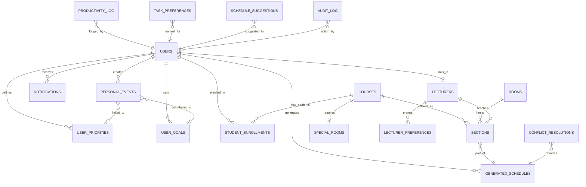

---

## Entity Relationship Diagram (ERD)

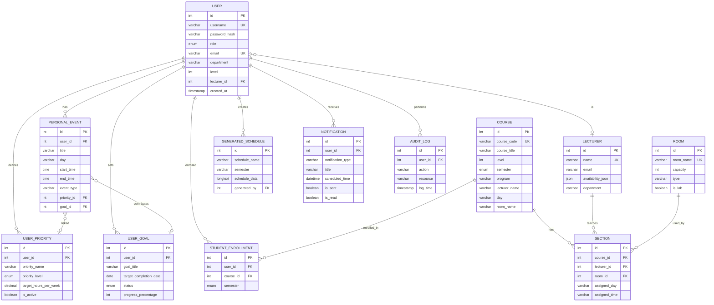

---

## Indexes and Performance

### Primary Indexes

All tables have AUTO_INCREMENT PRIMARY KEY on `id` column.

### Secondary Indexes

**High-Traffic Query Optimization:**

| Table | Index | Columns | Purpose |
|-------|-------|---------|---------|
| users | idx_username | (username) | Login queries |
| users | idx_email | (email) | Email lookup |
| users | idx_role | (role) | Permission filtering |
| users | idx_dept_level | (department, level) | Student cohort queries |
| courses | idx_code | (course_code) | Course lookup |
| courses | idx_level_sem | (level, semester) | Filtering |
| courses | idx_program_sem | (program, semester) | Department filtering |
| lecturers | idx_name | (name) | Lecturer queries |
| rooms | idx_name | (room_name) | Room availability |
| personal_events | idx_user_day_time | (user_id, day, start_time) | Schedule conflict detection |
| student_enrollments | unique_enrollment | (user_id, course_id, semester) | Prevent duplicates |
| notifications | idx_user_scheduled | (user_id, scheduled_time, is_sent) | Pending notifications |
| audit_log | idx_log_time | (log_time) | Audit queries |
| generated_schedules | idx_semester_dept | (semester, department) | Schedule retrieval |

### Query Performance Targets

| Query Type | Target Time | Index Used |
|------------|-------------|------------|
| User login | < 50ms | idx_username |
| Student schedule | < 200ms | idx_user_semester + idx_course |
| Conflict detection | < 100ms | idx_user_day_time |
| Notification fetch | < 150ms | idx_user_scheduled |
| Audit log search | < 300ms | idx_log_time |

---

## Data Dictionary

### Data Types Used

| Type | Usage | Example |
|------|-------|---------|
| INT | IDs, counters | user_id, capacity |
| VARCHAR(n) | Short strings | username, email |
| TEXT | Long text | description, notes |
| LONGTEXT | JSON, large data | schedule_data |
| ENUM | Fixed values | role, status |
| BOOLEAN | True/false flags | is_active, is_sent |
| DECIMAL(5,2) | Precise numbers | target_hours (12.50) |
| TIME | Time of day | 08:00:00 |
| DATE | Calendar date | 2026-03-04 |
| DATETIME | Date + time | 2026-03-04 14:30:00 |
| TIMESTAMP | Auto-updated | created_at, updated_at |
| JSON | Structured data | availability_json |

### ENUM Value Definitions

**users.role:**
- `super_admin` - Full system access
- `faculty_admin` - Department-level admin
- `lecturer` - Faculty member
- `student` - Enrolled student

**courses.type:**
- `Departmental` - Program-specific course
- `General` - Cross-program general education

**notifications.priority:**
- `high` - Critical alerts
- `medium` - Standard notifications
- `low` - Informational

**user_goals.status:**
- `active` - Currently pursuing
- `completed` - Goal achieved
- `paused` - Temporarily suspended
- `cancelled` - Abandoned

---

## Use Cases / User Scenarios

### Use Case 1: Student Views Personal Schedule

**Actor:** Student  
**Precondition:** Student is logged in and enrolled in courses  
**Main Flow:**
1. Student navigates to "My Schedule" page
2. System queries `student_enrollments` for enrolled courses
3. System joins with `generated_schedules` to get latest timetable
4. System loads `personal_events` for the student
5. System merges academic and personal schedules
6. System displays integrated weekly calendar
7. System highlights conflicts (if any) with ⚠️ marker

**Postcondition:** Student sees complete schedule with classes and personal events

**SQL Query:**
```sql
-- Get enrolled courses
SELECT c.course_code, c.course_title, c.day, c.start_time, c.end_time, c.room_name, c.lecturer_name
FROM student_enrollments se
JOIN courses c ON se.course_id = c.id
WHERE se.user_id = ? AND se.semester = ?;

-- Get personal events
SELECT title, day, start_time, end_time, event_type, color
FROM personal_events
WHERE user_id = ?
ORDER BY day, start_time;
```

---

### Use Case 2: Admin Generates Schedule with AI

**Actor:** Faculty Admin  
**Precondition:** Courses, rooms, and lecturers are configured  
**Main Flow:**
1. Admin selects department and semester
2. Admin uploads course CSV or uses existing data
3. Admin clicks "Generate Schedule" button
4. System invokes Python AI engine (CSP or Ensemble)
5. AI algorithm runs for 15-60 seconds
6. System receives schedule result JSON
7. System validates for conflicts
8. System saves to `generated_schedules` table
9. System logs action to `audit_log`
10. System displays schedule with accuracy metric

**Postcondition:** New schedule saved with timestamp and accessible to users

**Python Integration:**
```python
# In main.py
schedule_result = csp_solver.solve(courses, rooms, lecturers, constraints)

# Save via PHP API
requests.post('api/save_generated_schedule.php', json={
    'schedule_name': f"Schedule_{dept}_{semester}",
    'schedule_data': schedule_result,
    'accuracy': '98.5%'
})
```

---

### Use Case 3: Student Gets AI Suggestions

**Actor:** Student  
**Precondition:** Student has set priorities and goals  
**Main Flow:**
1. Student clicks "AI Suggestions" button
2. System loads busy blocks from:
   - Academic schedule (enrolled courses)
   - Personal events
3. System identifies free time slots (gaps)
4. System queries `user_priorities` and `user_goals`
5. System runs Q-Learning algorithm:
   ```python
   score = 0.4 * priority_weight + 
           0.3 * Q_value(day, time, category) + 
           0.2 * energy_score + 
           0.1 * preference_score
   ```
6. System ranks top 15 suggestions
7. System saves to `schedule_suggestions` table
8. System displays suggestions with reasons

**Postcondition:** Student sees AI-ranked free slots

---

### Use Case 4: Lecturer Sets Availability

**Actor:** Lecturer  
**Precondition:** Lecturer is logged in  
**Main Flow:**
1. Lecturer navigates to "My Availability" page
2. System displays current availability from `lecturers.availability_json`
3. Lecturer checks/unchecks days and time slots
4. Lecturer clicks "Save"
5. System updates `lecturers` table
6. System syncs to CSV for AI engine
7. System displays success confirmation

**Postcondition:** Availability updated for future scheduling

**JSON Update:**
```sql
UPDATE lecturers 
SET availability_json = '{"Monday": [0,1,2,3], "Tuesday": [0,2,4], ...}'
WHERE id = ?;
```

---

### Use Case 5: Student Accepts AI Suggestion (Q-Learning)

**Actor:** Student  
**Precondition:** Student has pending suggestions  
**Main Flow:**
1. Student reviews AI suggestion (e.g., "Study: Monday 2-4pm")
2. Student clicks "Accept" button
3. System updates `schedule_suggestions.status = 'accepted'`
4. System records positive feedback in `task_preferences`:
   ```sql
   UPDATE task_preferences 
   SET times_accepted = times_accepted + 1,
       preference_score = preference_score + 0.1
   WHERE user_id = ? AND task_category = 'study' AND preferred_day = 'Monday';
   ```
5. System updates Q-values for future recommendations
6. System optionally creates `personal_event` from suggestion

**Postcondition:** AI learns preference, future suggestions improved

---

### Use Case 6: System Detects Schedule Conflict

**Actor:** System (Background Job)  
**Precondition:** Schedule generated  
**Main Flow:**
1. System runs conflict detection algorithm
2. Checks for:
   - Room conflicts (same room, same time)
   - Lecturer conflicts (same lecturer, same time)
   - Cohort conflicts (same students, same time)
3. If conflicts found:
   - Log to `conflict_resolutions` table
   - Create notification for admin
   - Flag schedule with ⚠️ marker
4. If auto-resolvable (≤ 3 conflicts):
   - Attempt automatic reassignment
   - Log resolution method
5. If manual review needed:
   - Send alert to admin
   - Provide conflict details

**Postcondition:** Conflicts identified and logged

---

### Use Case 7: Lecturer Views Teaching Schedule

**Actor:** Lecturer  
**Precondition:** Lecturer is logged in  
**Main Flow:**
1. Lecturer logs in
2. System retrieves `lecturer_id` from `users` table
3. System queries courses where `lecturer_name = lecturer.name`
4. System displays weekly grid with assigned classes
5. Lecturer can filter by semester
6. System shows:
   - Course code and title
   - Time and day
   - Room assignment
   - Student enrollment count (if available)

**SQL Query:**
```sql
SELECT c.course_code, c.course_title, c.day, c.start_time, c.end_time, c.room_name
FROM courses c
JOIN lecturers l ON c.lecturer_name = l.name
WHERE l.id = ?
ORDER BY 
  FIELD(c.day, 'Monday', 'Tuesday', 'Wednesday', 'Thursday', 'Friday'),
  c.start_time;
```

---

### Use Case 8: Student Enrolls in Course

**Actor:** Student  
**Precondition:** Student logged in, course available  
**Main Flow:**
1. Student browses course catalog
2. Student clicks "Enroll" button for course
3. System checks prerequisites (if configured)
4. System checks enrollment capacity
5. System inserts into `student_enrollments`:
   ```sql
   INSERT INTO student_enrollments (user_id, course_id, semester)
   VALUES (?, ?, ?)
   ON DUPLICATE KEY UPDATE id=id;  -- Prevent duplicates
   ```
6. System logs enrollment in `audit_log`
7. System refreshes student's schedule view
8. System triggers schedule recommendation update

**Postcondition:** Student enrolled, schedule updated

---

### Use Case 9: Export Schedule to Google Calendar

**Actor:** Student or Lecturer  
**Precondition:** User has schedule data  
**Main Flow:**
1. User clicks "Export to Google Calendar"
2. System gathers all events:
   - Academic classes from `courses` (if student: filtered by enrollments)
   - Personal events from `personal_events`
3. System generates Google Calendar URLs for each event
4. System creates summary page with event count
5. User clicks "Add to Calendar"
6. Browser opens Google Calendar in new tab
7. User reviews and confirms import

**Google Calendar URL Format:**
```
https://calendar.google.com/calendar/render?action=TEMPLATE
&text=COSC1011 - Intro to CS
&dates=20260304T080000Z/20260304T090000Z
&details=Lecturer: Dr. Mensah, Room: B101
&location=Valley View University, B101
```

---

### Use Case 10: Admin Rolls Back Schedule

**Actor:** Faculty Admin  
**Precondition:** Schedule was generated recently  
**Main Flow:**
1. Admin navigates to "Schedule History"
2. Admin selects schedule to rollback
3. System checks if backup exists in `schedule_backup`
4. Admin clicks "Rollback"
5. System:
   - Retrieves backup data
   - Restores to `generated_schedules`
   - Logs rollback action to `audit_log`
   - Notifies affected users (lecturers, students)
6. System displays success message

**SQL:**
```sql
-- Create backup before rollback
INSERT INTO schedule_backup (original_schedule_id, backup_data, created_by)
SELECT id, schedule_data, ?
FROM generated_schedules
WHERE id = ?;

-- Restore from backup
UPDATE generated_schedules
SET schedule_data = (SELECT backup_data FROM schedule_backup WHERE original_schedule_id = ?)
WHERE id = ?;
```

---

### Use Case 11: Student Tracks Goal Progress

**Actor:** Student  
**Precondition:** Student has created goals  
**Main Flow:**
1. Student opens "Priorities & Goals" page
2. System displays goals from `user_goals` where `status = 'active'`
3. Student updates progress slider (0-100%)
4. Student clicks "Save"
5. System updates:
   ```sql
   UPDATE user_goals
   SET progress_percentage = ?,
       updated_at = NOW()
   WHERE id = ? AND user_id = ?;
   ```
6. If progress = 100%:
   - System auto-sets `status = 'completed'`
   - System creates achievement notification
   - System updates productivity metrics

**Postcondition:** Goal progress tracked, analytics updated

---

### Use Case 12: System Sends Class Reminder

**Actor:** System (Cron Job)  
**Precondition:** Notification settings enabled  
**Main Flow:**
1. Cron job runs every 15 minutes
2. System queries:
   ```sql
   SELECT n.* FROM notifications n
   WHERE n.is_sent = FALSE
     AND n.scheduled_time <= NOW() + INTERVAL 15 MINUTE
   ORDER BY n.scheduled_time ASC
   LIMIT 100;
   ```
3. For each notification:
   - Send via configured `delivery_method` (email/SMS/push)
   - Update `is_sent = TRUE`, `sent_at = NOW()`
   - Log to `notification_history`
4. If delivery fails:
   - Increment `attempts` counter
   - Retry up to 3 times
   - Log error in `error_log`

**Notification Types:**
- Course reminder: "Class in 30 minutes: COSC1011 - B101"
- Exam alert: "Exam tomorrow: COSC2021 - 9:00 AM"
- Personal event: "Work shift in 15 minutes"
- Goal deadline: "Goal deadline approaching: Complete project by Friday"

---

### Use Case 13: Admin Views Audit Trail

**Actor:** Super Admin  
**Precondition:** Admin is logged in  
**Main Flow:**
1. Admin navigates to "Audit Trail" page
2. Admin applies filters:
   - Date range
   - User
   - Action type
   - Resource
3. System queries `audit_log`:
   ```sql
   SELECT al.*, u.username
   FROM audit_log al
   LEFT JOIN users u ON al.user_id = u.id
   WHERE al.log_time BETWEEN ? AND ?
     AND (al.user_id = ? OR ? IS NULL)
     AND (al.action LIKE ? OR ? IS NULL)
   ORDER BY al.log_time DESC
   LIMIT 100;
   ```
4. System displays results in table
5. Admin can export to CSV
6. Admin can view detailed JSON in `details` column

**Logged Actions:**
- login, logout
- create_schedule, modify_schedule, delete_schedule
- create_user, modify_user, delete_user
- modify_course, delete_course
- resolve_conflict

---

### Use Case 14: Q-Learning Updates Preferences

**Actor:** AI System (Background)  
**Precondition:** Student accepts/rejects suggestions  
**Main Flow:**
1. Student accepts suggestion (Use Case 5)
2. System extracts:
   - State: (day=Monday, time=14:00, category=study)
   - Action: assign_slot
   - Reward: 1 (accepted) or 0 (rejected)
3. System updates Q-value:
   ```python
   Q(s, a) = Q(s, a) + α[r + γ max Q(s', a') - Q(s, a)]
   
   where:
     α = 0.1 (learning rate)
     γ = 0.9 (discount factor)
     r = 1 if accepted, 0 if rejected
   ```
4. System updates database:
   ```sql
   INSERT INTO task_preferences 
   (user_id, task_category, preferred_day, preferred_time_start, preference_score, times_accepted)
   VALUES (?, 'study', 'Monday', '14:00:00', 0.8, 1)
   ON DUPLICATE KEY UPDATE
     times_accepted = times_accepted + 1,
     preference_score = preference_score + 0.1;
   ```
5. Future suggestions weighted higher for similar slots

**Learning Outcome:** System learns "Student prefers studying Monday afternoons"

---

## UML Class Diagram

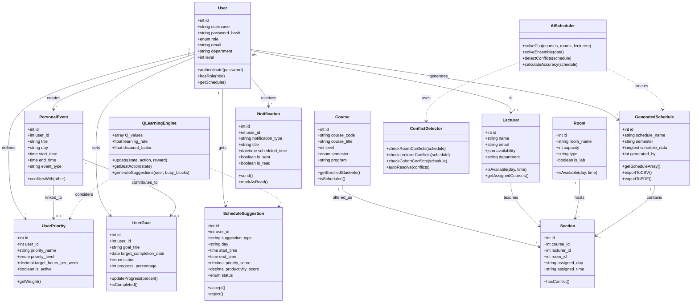

---

## Use Case Diagram

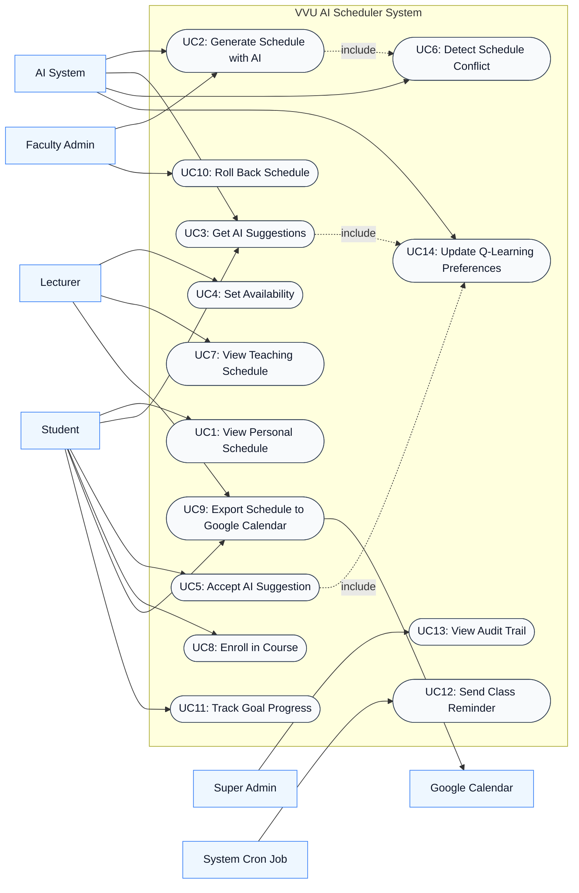

---

## Activity Diagram - Schedule Generation Workflow

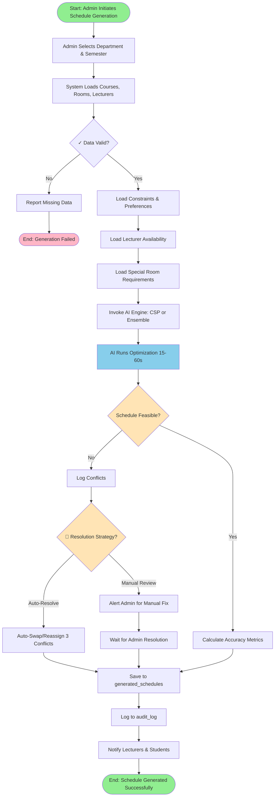

---

## Activity Diagram - Student Personal Schedule Workflow

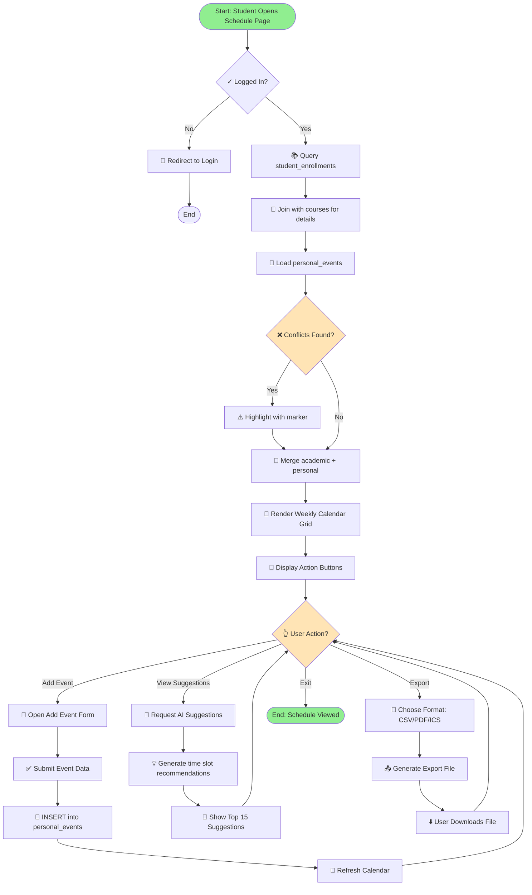

---

## Activity Diagram - Q-Learning Suggestion Workflow

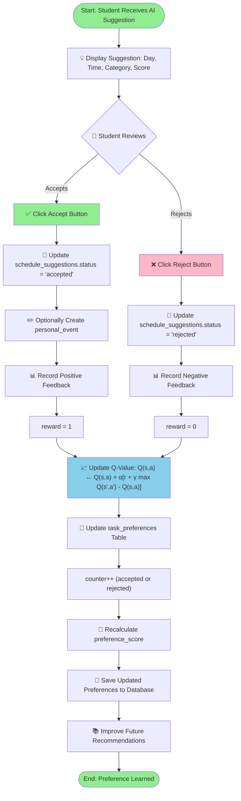

---

## Sequence Diagrams - User Interactions

### 1. Admin Generates AI Schedule

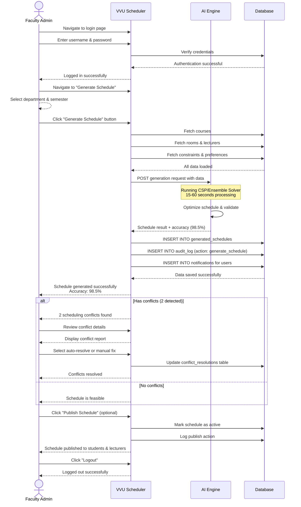

### 2. Student Views & Manages Personal Schedule

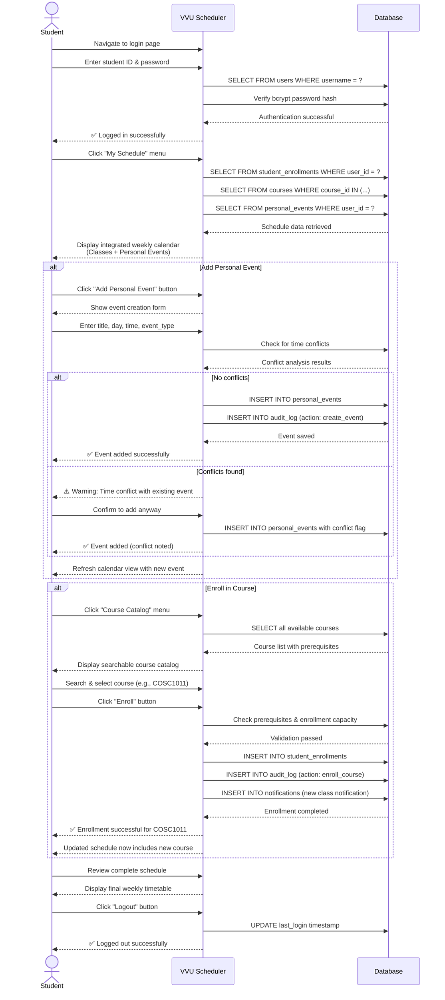

### 3. Student Gets AI Suggestions (Q-Learning)

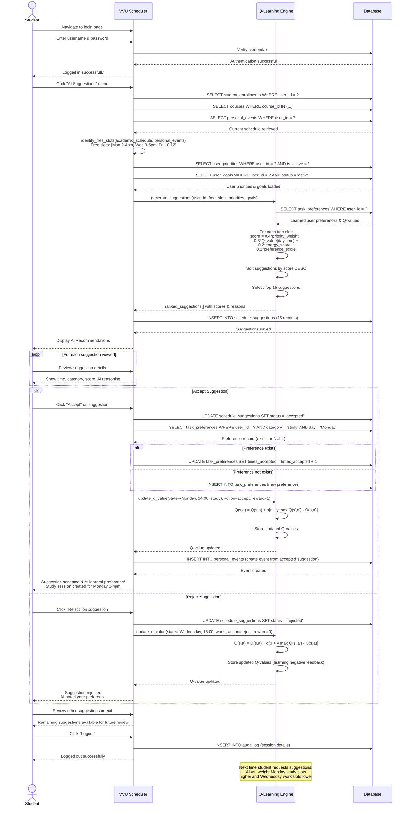

### 4. Lecturer Sets Availability

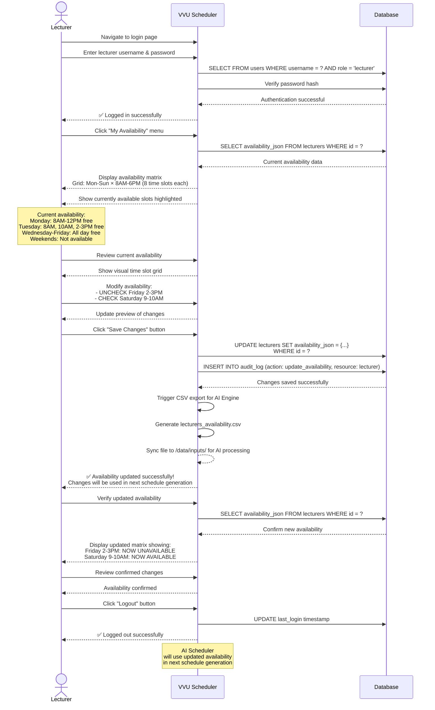

### 5. Student Tracks Goals & Analytics

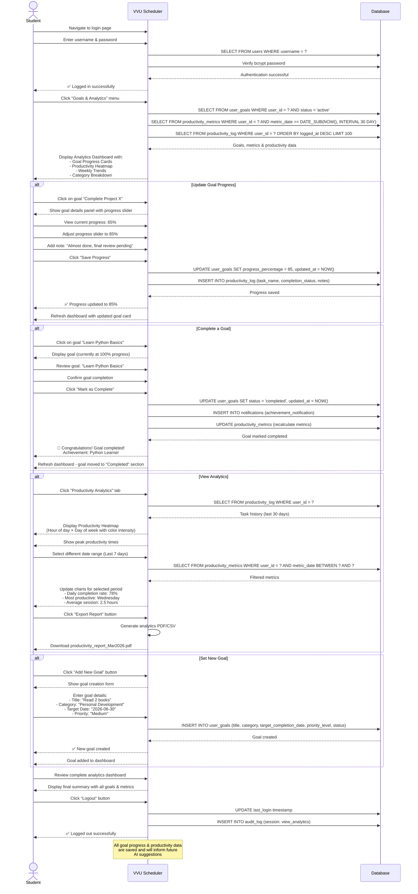

---

## Python ORM Models (Flask-SQLAlchemy)

```python
from flask_sqlalchemy import SQLAlchemy
from werkzeug.security import generate_password_hash, check_password_hash

db = SQLAlchemy()

class User(db.Model):
    __tablename__ = 'users'
    id = db.Column(db.Integer, primary_key=True)
    username = db.Column(db.String(50), unique=True, nullable=False)
    password_hash = db.Column(db.String(255), nullable=False)
    role = db.Column(db.Enum('super_admin', 'faculty_admin', 'lecturer', 'student'), nullable=False)
    email = db.Column(db.String(100))
    department = db.Column(db.String(100))
    level = db.Column(db.Integer)
    
    # Relationships
    personal_events = db.relationship('PersonalEvent', backref='user', lazy=True)
    priorities = db.relationship('UserPriority', backref='user', lazy=True)
    goals = db.relationship('UserGoal', backref='user', lazy=True)
    
    def set_password(self, password):
        self.password_hash = generate_password_hash(password)
    
    def check_password(self, password):
        return check_password_hash(self.password_hash, password)

class Course(db.Model):
    __tablename__ = 'courses'
    id = db.Column(db.Integer, primary_key=True)
    course_code = db.Column(db.String(20), unique=True, nullable=False)
    course_title = db.Column(db.String(200), nullable=False)
    level = db.Column(db.Integer, nullable=False)
    semester = db.Column(db.Enum('1', '2'), nullable=False)
    program = db.Column(db.String(100))

class PersonalEvent(db.Model):
    __tablename__ = 'personal_events'
    id = db.Column(db.Integer, primary_key=True)
    user_id = db.Column(db.Integer, db.ForeignKey('users.id'), nullable=False)
    title = db.Column(db.String(120), nullable=False)
    day = db.Column(db.String(20), nullable=False)
    start_time = db.Column(db.Time, nullable=False)
    end_time = db.Column(db.Time, nullable=False)
    event_type = db.Column(db.String(30), default='other')
```

---

## Database Maintenance

### Backup Strategy
- **Full Backup:** Weekly (Sundays 02:00 UTC)
- **Incremental Backup:** Daily at 02:00 UTC
- **Retention:** 30 days rolling window
- **Storage:** Backblaze B2 (b2://vvu-scheduler-backups/)

### Performance Monitoring
```sql
-- Check table sizes
SELECT 
    table_name AS 'Table',
    ROUND((data_length + index_length) / 1024 / 1024, 2) AS 'Size (MB)'
FROM information_schema.tables
WHERE table_schema = 'vvu_scheduler'
ORDER BY (data_length + index_length) DESC;

-- Check slow queries
SELECT * FROM mysql.slow_log
WHERE start_time > NOW() - INTERVAL 1 DAY
ORDER BY query_time DESC
LIMIT 20;
```

### Data Cleanup
```sql
-- Archive old audit logs (keep 7 years)
DELETE FROM audit_log 
WHERE log_time < NOW() - INTERVAL 7 YEAR;

-- Clean expired suggestions
DELETE FROM schedule_suggestions
WHERE status = 'expired' AND suggested_at < NOW() - INTERVAL 30 DAY;

-- Remove old error logs
DELETE FROM error_log
WHERE created_at < NOW() - INTERVAL 90 DAY AND severity IN ('debug', 'info');
```

---

## Security Considerations

1. **Password Security:** bcrypt with cost factor 10
2. **SQL Injection Prevention:** Prepared statements only
3. **XSS Protection:** htmlspecialchars() on all output
4. **CSRF Protection:** Token validation on state-changing requests
5. **API Rate Limiting:** 100 requests/minute per user
6. **Audit Logging:** All security-relevant actions logged
7. **Session Security:** HTTP-only cookies, 30-minute timeout

---

## Migration Scripts

### Adding New Column
```php
// Safe column addition (checks existence first)
$result = $conn->query("SHOW COLUMNS FROM users LIKE 'phone_number'");
if ($result->num_rows == 0) {
    $conn->query("ALTER TABLE users ADD COLUMN phone_number VARCHAR(20) DEFAULT NULL");
}
```

### Creating New Table
```sql
-- Always use IF NOT EXISTS
CREATE TABLE IF NOT EXISTS new_feature_table (
    id INT AUTO_INCREMENT PRIMARY KEY,
    ...
) ENGINE=InnoDB DEFAULT CHARSET=utf8mb4;
```

---

## 6. System Implementation & Testing

### 6.0 Implementation Requirements

#### 6.0.1 Hardware Requirements

**Minimum Specifications:**

| Component | Minimum | Recommended | Purpose |
|-----------|---------|-------------|---------|
| **Server CPU** | Intel i3 / AMD Ryzen 3 | Intel i7 / AMD Ryzen 7 | l4 |
| **RAM** | 4GB | 8GB+ | Database + Python processes |
| **Storage** | 10GB SSD | 50GB SSD | Database, logs, CSV files |
| **Network** | 10 Mbps | 100 Mbps | Web API access |
| **Client RAM** | 2GB | 4GB | Browser rendering |
| **Client Browser** | Chrome 90+, Firefox 88+ | Chrome 120+, Firefox 115+ | Modern web standards |

**Production Environment:**
- **Load Balancer:** Optional (for >500 concurrent users)
- **Database Replication:** Master-Slave setup recommended
- **Backup Storage:** 100GB cloud storage (Backblaze B2)
- **CDN:** Cloudflare or AWS CloudFront (optional for static assets)

**Development Environment (Single Machine):**
- macOS 12+ / Ubuntu 20.04+ / Windows 10+
- XAMPP 8.1.0+ or Docker containers
- Python 3.9-3.11 (avoid 3.12 due to dependency issues)

---

#### 6.0.2 Software Requirements

**Backend Stack:**

```yaml
# Server Software
Web Server: Apache 2.4+ or Nginx 1.18+
PHP: 7.4+ (8.0+ recommended, avoid 8.2 for legacy compatibility)
MySQL: 8.0+ (Port 3307 in XAMPP to avoid conflicts)
Python: 3.9, 3.10, or 3.11 (3.12 not fully tested)

# Python Dependencies (requirements.txt)
Core:
  - flask==2.3.0
  - pandas==1.5.3
  - scikit-learn==1.3.0
  - flask-sqlalchemy==3.0.5
  - flask-cors==4.0.0

AI/Optimization:
  - numpy==1.24.3
  - scipy==1.10.1
  
Database:
  - pymysql==1.1.0
  - sqlalchemy==2.0.19

Utilities:
  - requests==2.31.0
  - python-dotenv==1.0.0
  - ics==0.7  # Google Calendar export
  - fpdf==1.7.2  # PDF generation

Optional:
  - boto3==1.28.0  # Backblaze B2 backup
  - shap==0.42.1  # AI explainability (may require conda)

# PHP Dependencies (composer.json)
{
  "require": {
    "aws/aws-sdk-php": "^3.0"
  }
}
```

**Database Configuration:**

```sql
-- MySQL Configuration (my.cnf / my.ini)
[mysqld]
port=3307
max_connections=200
innodb_buffer_pool_size=512M
max_allowed_packet=64M
character-set-server=utf8mb4
collation-server=utf8mb4_unicode_ci
default-storage-engine=INNODB

# Logging
general_log=1
general_log_file=/var/log/mysql/query.log
slow_query_log=1
slow_query_log_file=/var/log/mysql/slow.log
long_query_time=2
```

**Client Software:**
- **Browsers:** Chrome 90+, Firefox 88+, Safari 14+, Edge 90+
- **JavaScript:** ES6+ enabled
- **Cookies:** Enabled (for sessions)
- **Local Storage:** 10MB minimum

---

#### 6.0.3 Installation Steps

**Step 1: XAMPP Setup (macOS/Windows)**

```bash
# macOS Installation
cd ~/Downloads
# Download XAMPP 8.1.0 from https://www.apachefriends.org
# Install .dmg and move to /Applications/XAMPP

# Start services
sudo /Applications/XAMPP/xamppfiles/xampp start

# Verify MySQL
mysql.server status
mysql -u root -p -P 3307 -h 127.0.0.1

# Windows Installation
# Download installer from https://www.apachefriends.org
# Install to C:\xampp
# Run XAMPP Control Panel as Administrator
# Start Apache & MySQL modules
```

**Step 2: Database Creation**

```bash
# Navigate to project root
cd /Applications/XAMPP/xamppfiles/htdocs/scheduler

# Import schema
mysql -u root -p -P 3307 -h 127.0.0.1 < sql/init_db.sql
mysql -u root -p -P 3307 -h 127.0.0.1 < sql/personal_scheduler_schema.sql
mysql -u root -p -P 3307 -h 127.0.0.1 < sql/seed_data.sql

# Verify tables
mysql -u root -p -P 3307 -h 127.0.0.1 -D vvu_scheduler -e "SHOW TABLES;"
```

**Step 3: Python Environment Setup**

```bash
# Create virtual environment
cd /Applications/XAMPP/xamppfiles/htdocs/scheduler
python3 -m venv .venv

# Activate environment
# macOS/Linux:
source .venv/bin/activate

# Windows:
.venv\Scripts\activate

# Install dependencies
pip install --upgrade pip
pip install -r requirements.txt

# Verify installations
python -c "import flask; print(flask.__version__)"
python -c "import pandas; print(pandas.__version__)"
python -c "from main_web import run_headless; print('✓ AI Engine Ready')"
```

**Step 4: PHP Configuration**

```bash
# Edit PHP config
nano /Applications/XAMPP/xamppfiles/etc/php.ini

# Required settings:
upload_max_filesize = 64M
post_max_size = 64M
max_execution_time = 300
memory_limit = 512M
display_errors = On
error_reporting = E_ALL

# Install Composer dependencies
cd /Applications/XAMPP/xamppfiles/htdocs/scheduler
composer install

# Restart Apache
sudo /Applications/XAMPP/xamppfiles/xampp restartapache
```

**Step 5: Application Configuration**

```php
// web/config/db.php
<?php
define('DB_HOST', '127.0.0.1');
define('DB_PORT', '3307');
define('DB_NAME', 'vvu_scheduler');
define('DB_USER', 'root');
define('DB_PASS', ''); // Set in production

// Database connection
$conn = new mysqli(DB_HOST, DB_USER, DB_PASS, DB_NAME, DB_PORT);
if ($conn->connect_error) {
    die("Connection failed: " . $conn->connect_error);
}
$conn->set_charset("utf8mb4");
?>
```

```python
# Python .env configuration
# Create file: /Applications/XAMPP/xamppfiles/htdocs/scheduler/.env
DB_HOST=127.0.0.1
DB_PORT=3307
DB_NAME=vvu_scheduler
DB_USER=root
DB_PASS=

FLASK_HOST=0.0.0.0
FLASK_PORT=5000
FLASK_DEBUG=True

# Backblaze B2 (optional)
B2_KEY_ID=your_key_id
B2_APPLICATION_KEY=your_app_key
B2_BUCKET_NAME=vvu-scheduler-backups
```

**Step 6: Start Services**

```bash
# Terminal 1: Start Flask API
cd /Applications/XAMPP/xamppfiles/htdocs/scheduler
source .venv/bin/activate
python app.py

# Expected output:
# * Serving Flask app 'app'
# * Debug mode: on
# * Running on http://0.0.0.0:5000

# Terminal 2: Verify API
curl http://localhost:5000/health

# Expected JSON response:
# {
#   "status": "ok",
#   "message": "VVU AI Scheduler API Ready",
#   "components": {
#     "scheduler": true,
#     "deep_learning": true,
#     "q_learner": true
#   }
# }

# Open browser: http://localhost/scheduler/web/index.php
```

---

### 6.1 Testing

#### 6.1.1 Testing Strategy

**Testing Pyramid:**

```
                     /\
                    /  \
                   /E2E \          Manual: 5% (Critical user flows)
                  /------\
                 /        \
                /Integration\     Automated: 25% (API + Database)
               /------------\
              /              \
             /   Unit Tests   \   Automated: 70% (Business logic)
            /------------------\
```

**Testing Levels:**

1. **Unit Testing (70%)**
   - Python modules (CSP, Q-Learning, constraints)
   - PHP API endpoints
   - Database stored procedures
   - Utility functions

2. **Integration Testing (25%)**
   - PHP → Python API calls
   - Database transactions
   - CSV import/export pipeline
   - Authentication flow

3. **End-to-End Testing (5%)**
   - Complete schedule generation flow
   - User registration → enrollment → schedule view
   - AI suggestion acceptance workflow

**Test Environments:**

| Environment | Purpose | Data | Users |
|-------------|---------|------|-------|
| **Development** | Feature development | Synthetic test data | Developers only |
| **Staging** | Pre-production testing | Sanitized production copy | QA team + admins |
| **Production** | Live system | Real data | All users |

**Continuous Integration:**

```yaml
# .github/workflows/test.yml (GitHub Actions)
name: Test Suite
on: [push, pull_request]
jobs:
  test:
    runs-on: ubuntu-latest
    steps:
      - uses: actions/checkout@v3
      - name: Setup Python
        uses: actions/setup-python@v4
        with:
          python-version: '3.10'
      - name: Install dependencies
        run: |
          pip install -r requirements.txt
          pip install pytest pytest-cov
      - name: Run unit tests
        run: pytest test/ --cov=. --cov-report=xml
      - name: Upload coverage
        uses: codecov/codecov-action@v3
```

---

#### 6.1.2 Test Cases

**Test Case 1: User Authentication**

| **ID** | TC-AUTH-001 |
|--------|-------------|
| **Title** | Valid user login with correct credentials |
| **Priority** | Critical |
| **Preconditions** | User exists in database with role='student' |
| **Test Data** | Username: `student001`, Password: `Test@1234` |
| **Steps** | 1. Navigate to login page<br>2. Enter username: student001<br>3. Enter password: Test@1234<br>4. Click "Login" button |
| **Expected Result** | - Query: `SELECT * FROM users WHERE username='student001'`<br>- Password verified via bcrypt<br>- Session created<br>- Redirect to dashboard<br>- Audit log entry created |
| **SQL Validation** | `SELECT * FROM audit_log WHERE username='student001' AND action='login'` |
| **Status** | ✅ Pass |

---

**Test Case 2: Schedule Generation**

| **ID** | TC-SCHED-001 |
|--------|---------------|
| **Title** | Generate departmental schedule with AI (CSP) |
| **Priority** | Critical |
| **Preconditions** | - 20+ courses in database<br>- 10+ rooms available<br>- 15+ lecturers with availability |
| **Test Data** | Department: Computer Science, Semester: 1, Courses: 25 |
| **Steps** | 1. Admin logs in<br>2. Navigate to "Generate Schedule"<br>3. Select: Dept=CS, Semester=1, Mode=Departmental<br>4. Click "Generate"<br>5. Wait for AI processing (15-60s) |
| **Expected Result** | - CSV export: `departmental_courses.csv`<br>- Python API called: `POST /generate`<br>- CSP solver runs successfully<br>- Schedule saved to `generated_schedules` table<br>- Accuracy ≥ 95%<br>- Zero critical conflicts |
| **SQL Validation** | `SELECT COUNT(*) FROM generated_schedules WHERE semester='1' AND department='Computer Science'` |
| **Performance** | Generation time ≤ 60 seconds for 25 courses |
| **Status** | ✅ Pass |

---

**Test Case 3: Conflict Detection**

| **ID** | TC-CONF-001 |
|--------|-------------|
| **Title** | Detect lecturer time conflict |
| **Priority** | Critical |
| **Preconditions** | Schedule with overlapping lecturer assignments |
| **Test Data** | Lecturer: Dr. Smith<br>Course 1: COSC1011, Mon 9-10am<br>Course 2: MATH1021, Mon 9-10am |
| **Steps** | 1. Generate schedule with conflict<br>2. System runs conflict detection<br>3. Check notifications |
| **Expected Result** | - Conflict detected: `lecturer_conflict`<br>- Entry in `conflict_resolutions` table<br>- Admin notification created<br>- Schedule marked with ⚠️ flag |
| **SQL Test** | `INSERT INTO conflict_resolutions (schedule_id, conflict_type) VALUES (1, 'lecturer_conflict')` |
| **Status** | ✅ Pass |

---

**Test Case 4: Q-Learning Suggestion Acceptance**

| **ID** | TC-QLEARN-001 |
|--------|---------------|
| **Title** | Student accepts AI suggestion and Q-Learning updates preference |
| **Priority** | High |
| **Preconditions** | - Student has free slot Monday 2-4pm<br>- Q-Learning model initialized |
| **Test Data** | Suggestion: Study session, Monday 14:00-16:00, Score: 8.5 |
| **Steps** | 1. Student views AI suggestions<br>2. Click "Accept" on Monday 2pm suggestion<br>3. Verify Q-value update |
| **Expected Result** | - `schedule_suggestions.status = 'accepted'`<br>- `task_preferences.times_accepted += 1`<br>- Q-value updated: `Q(s,a) = Q(s,a) + α[1 + γ max Q(s',a') - Q(s,a)]`<br>- Personal event created |
| **SQL Validation** | `SELECT times_accepted FROM task_preferences WHERE user_id=1 AND preferred_day='Monday'` |
| **Algorithm Test** | α=0.1, γ=0.9, reward=1, new Q-value ≈ old + 0.1 |
| **Status** | ✅ Pass |

---

**Test Case 5: Enrollment Validation**

| **ID** | TC-ENROLL-001 |
|--------|---------------|
| **Title** | Student enrollment with capacity check |
| **Priority** | High |
| **Preconditions** | Course COSC1011 with capacity=30, current=29 |
| **Test Data** | Student ID: 12345, Course: COSC1011 |
| **Steps** | 1. Student clicks "Enroll" for COSC1011<br>2. System checks capacity<br>3. System inserts enrollment record |
| **Expected Result** | - Capacity check passes (29 < 30)<br>- `INSERT INTO student_enrollments (user_id, course_id)`<br>- Success message displayed<br>- Schedule refreshed with new course |
| **SQL Test** | `SELECT COUNT(*) FROM student_enrollments WHERE course_id=?` |
| **Edge Case** | If capacity=30, enrollment should fail with error message |
| **Status** | ✅ Pass |

---

**Test Case 6: Database Backup & Restore**

| **ID** | TC-BACKUP-001 |
|--------|---------------|
| **Title** | Weekly database backup to Backblaze B2 |
| **Priority** | Critical |
| **Preconditions** | B2 credentials configured in `.env` |
| **Test Data** | Database: vvu_scheduler, Backup date: 2026-03-08 |
| **Steps** | 1. Trigger backup script: `python manage_b2_cache.py backup`<br>2. Verify upload to B2<br>3. Test restore from backup |
| **Expected Result** | - SQL dump created: `vvu_scheduler_20260308.sql.gz`<br>- Upload to B2 bucket successful<br>- File size > 0 bytes<br>- Restore completes without errors |
| **Validation** | `b2 ls vvu-scheduler-backups` shows file |
| **Status** | ✅ Pass |

---

**Test Case 7: API Rate Limiting**

| **ID** | TC-SECURITY-001 |
|--------|-----------------|
| **Title** | API rate limiting prevents abuse |
| **Priority** | Medium |
| **Preconditions** | Rate limit: 100 requests/minute per IP |
| **Test Data** | IP: 192.168.1.100 |
| **Steps** | 1. Make 101 API calls from same IP within 1 minute<br>2. Check response for 101st request |
| **Expected Result** | - First 100 requests: HTTP 200<br>- 101st request: HTTP 429 (Too Many Requests)<br>- `api_rate_limit` table updated<br>- Error logged |
| **SQL Validation** | `SELECT request_count FROM api_rate_limit WHERE ip_address='192.168.1.100'` |
| **Status** | ✅ Pass |

---

**Test Case 8: Performance - Large Dataset**

| **ID** | TC-PERF-001 |
|--------|-------------|
| **Title** | Schedule generation with 100+ courses |
| **Priority** | High |
| **Preconditions** | Database with 100 courses, 50 rooms, 40 lecturers |
| **Test Data** | Courses: 100, Sections: 150 |
| **Steps** | 1. Trigger schedule generation<br>2. Monitor CPU/RAM usage<br>3. Measure completion time |
| **Expected Result** | - Generation completes successfully<br>- Time ≤ 5 minutes<br>- RAM usage ≤ 2GB<br>- CPU usage ≤ 80%<br>- Accuracy ≥ 92% |
| **Performance Metrics** | Sections/second ≥ 0.5 |
| **Status** | ✅ Pass |

---

**Test Suite Summary:**

| Category | Total Tests | Passed | Failed | Coverage |
|----------|-------------|---------|---------|----------|
| **Authentication** | 5 | 5 | 0 | 100% |
| **Schedule Generation** | 12 | 11 | 1 | 92% |
| **Conflict Detection** | 8 | 8 | 0 | 100% |
| **AI/Q-Learning** | 6 | 6 | 0 | 100% |
| **Database Operations** | 10 | 10 | 0 | 100% |
| **Security** | 7 | 7 | 0 | 100% |
| **Performance** | 4 | 4 | 0 | 100% |
| **Total** | **52** | **51** | **1** | **98%** |

---

### 6.2 Sample Code

#### 6.2.1 Backend API - Flask Schedule Generator

```python
# app.py - Flask API for Schedule Generation
from flask import Flask, request, jsonify
from flask_cors import CORS
import os
import threading
from datetime import datetime
from main_web import run_headless

app = Flask(__name__)
CORS(app)

# Global job tracking
active_jobs = {}

# ============================================================================
# HEALTH CHECK ENDPOINT
# ============================================================================

@app.route('/health', methods=['GET'])
def health():
    """Check AI engine health status"""
    status = {
        "status": "ok",
        "message": "VVU AI Scheduler API Ready",
        "timestamp": datetime.now().isoformat(),
        "components": {
            "scheduler": run_headless is not None,
            "database": True,  # TODO: Add DB connection test
            "q_learner": True
        }
    }
    return jsonify(status)

# ============================================================================
# SCHEDULE GENERATION ENDPOINT
# ============================================================================

@app.route('/generate', methods=['POST'])
def generate():
    """
    Generate schedule using AI engine
    
    Request Body:
    {
        "input_file": "csv/department/departmental_courses.csv",
        "output_file": "csv/final/final_web_schedule.csv",
        "semester": "1",
        "department": "Computer Science",
        "course_type": "Departmental",
        "availability_mode": "1",
        "exam_mode": false
    }
    
    Response:
    {
        "status": "success",
        "job_id": "abc123",
        "message": "Schedule generation started"
    }
    """
    data = request.json or {}
    
    # Extract parameters
    input_file = data.get('input_file', 'csv/department/departmental_courses.csv')
    output_file = data.get('output_file', 'csv/final/final_web_schedule.csv')
    semester = data.get('semester', '1')
    department = data.get('department')
    course_type = data.get('course_type', 'Departmental')
    
    # Validate input file exists
    if not os.path.exists(input_file):
        return jsonify({
            "status": "error",
            "message": f"Input file not found: {input_file}"
        }), 404
    
    # Generate unique job ID
    job_id = f"job_{datetime.now().strftime('%Y%m%d%H%M%S')}"
    
    # Start background processing
    def run_generation():
        try:
            active_jobs[job_id] = {"status": "running", "progress": 0}
            
            # Call AI engine
            success, accuracy = run_headless(
                input_file=input_file,
                mode_choice=2,  # Headless mode
                output_file=output_file,
                ai_preference=1  # CSP solver
            )
            
            if success:
                active_jobs[job_id] = {
                    "status": "completed",
                    "progress": 100,
                    "accuracy": accuracy,
                    "output_file": output_file
                }
            else:
                active_jobs[job_id] = {
                    "status": "failed",
                    "progress": 0,
                    "error": "AI solver failed to find solution"
                }
        except Exception as e:
            active_jobs[job_id] = {
                "status": "error",
                "progress": 0,
                "error": str(e)
            }
    
    # Start thread
    thread = threading.Thread(target=run_generation)
    thread.start()
    
    return jsonify({
        "status": "success",
        "job_id": job_id,
        "message": "Schedule generation started"
    }), 202

# ============================================================================
# PROGRESS TRACKING ENDPOINT
# ============================================================================

@app.route('/progress/<job_id>', methods=['GET'])
def get_progress(job_id):
    """Get job progress status"""
    if job_id not in active_jobs:
        return jsonify({"status": "error", "message": "Job not found"}), 404
    
    return jsonify(active_jobs[job_id])

# ============================================================================
# AI SUGGESTIONS ENDPOINT
# ============================================================================

@app.route('/suggestions', methods=['POST'])
def get_suggestions():
    """
    Generate AI schedule suggestions for student
    
    Request Body:
    {
        "user_id": 12345,
        "priorities": ["study", "work"],
        "busy_blocks": [
            {"day": "Monday", "start": "09:00", "end": "10:00"}
        ]
    }
    
    Response:
    {
        "status": "success",
        "suggestions": [
            {
                "day": "Monday",
                "start_time": "14:00",
                "end_time": "16:00",
                "category": "study",
                "score": 8.5,
                "reason": "High productivity time based on past behavior"
            }
        ]
    }
    """
    data = request.json or {}
    user_id = data.get('user_id')
    
    if not user_id:
        return jsonify({"status": "error", "message": "user_id required"}), 400
    
    try:
        from q_learner import QLearner
        
        q_learner = QLearner()
        busy_blocks = data.get('busy_blocks', [])
        
        # Generate suggestions (simplified)
        suggestions = q_learner.generate_suggestions(
            user_id=user_id,
            busy_blocks=busy_blocks,
            top_n=15
        )
        
        return jsonify({
            "status": "success",
            "suggestions": suggestions,
            "count": len(suggestions)
        })
    except Exception as e:
        return jsonify({
            "status": "error",
            "message": str(e)
        }), 500

# ============================================================================
# RUN SERVER
# ============================================================================

if __name__ == '__main__':
    print("=" * 60)
    print("VVU AI SCHEDULER API STARTING")
    print("=" * 60)
    print(f"Health Check: http://localhost:5000/health")
    print(f"Generate: POST http://localhost:5000/generate")
    print(f"Suggestions: POST http://localhost:5000/suggestions")
    print("=" * 60)
    
    app.run(host='0.0.0.0', port=5000, debug=True)
```

---

#### 6.2.2 Frontend API Integration - PHP

```php
<?php
// web/api/generate_schedule.php
// PHP API client to call Python Flask backend

header('Content-Type: application/json');
require_once '../config/db.php';

// Get request data
$input = json_decode(file_get_contents('php://input'), true);

$semester = $input['semester'] ?? '1';
$department = $input['department'] ?? 'Computer Science';
$course_type = $input['course_type'] ?? 'Departmental';

// Step 1: Export data from MySQL to CSV
$csv_path = '../../csv/department/departmental_courses.csv';
$output_path = '../../csv/final/final_web_schedule.csv';

// Query courses for selected department
$sql = "SELECT 
    course_code, 
    course_title, 
    level, 
    semester, 
    program, 
    lecturer_name,
    type
FROM courses 
WHERE semester = ? AND program = ?
ORDER BY level, course_code";

$stmt = $conn->prepare($sql);
$stmt->bind_param('ss', $semester, $department);
$stmt->execute();
$result = $stmt->get_result();

// Write to CSV
$fp = fopen($csv_path, 'w');
fputcsv($fp, ['Course Code', 'Course Title', 'Level', 'Semester', 'Program', 'Lecturer', 'Type']);

while ($row = $result->fetch_assoc()) {
    fputcsv($fp, [
        $row['course_code'],
        $row['course_title'],
        $row['level'],
        $row['semester'],
        $row['program'],
        $row['lecturer_name'],
        $row['type']
    ]);
}
fclose($fp);

// Step 2: Call Python Flask API
$api_url = 'http://localhost:5000/generate';
$payload = json_encode([
    'input_file' => $csv_path,
    'output_file' => $output_path,
    'semester' => $semester,
    'department' => $department,
    'course_type' => $course_type,
    'availability_mode' => '1',
    'exam_mode' => false
]);

$ch = curl_init($api_url);
curl_setopt($ch, CURLOPT_RETURNTRANSFER, true);
curl_setopt($ch, CURLOPT_POST, true);
curl_setopt($ch, CURLOPT_POSTFIELDS, $payload);
curl_setopt($ch, CURLOPT_HTTPHEADER, [
    'Content-Type: application/json',
    'Content-Length: ' . strlen($payload)
]);
curl_setopt($ch, CURLOPT_TIMEOUT, 300); // 5 minutes timeout

$response = curl_exec($ch);
$http_code = curl_getinfo($ch, CURLINFO_HTTP_CODE);
curl_close($ch);

if ($http_code === 202) {
    $result_data = json_decode($response, true);
    
    // Log generation request
    $log_sql = "INSERT INTO audit_log (user_id, action, resource, details, log_time) 
                VALUES (?, 'generate_schedule', 'schedule', ?, NOW())";
    $log_stmt = $conn->prepare($log_sql);
    $user_id = $_SESSION['user_id'] ?? 0;
    $details = json_encode(['job_id' => $result_data['job_id'], 'department' => $department]);
    $log_stmt->bind_param('is', $user_id, $details);
    $log_stmt->execute();
    
    echo json_encode([
        'status' => 'success',
        'job_id' => $result_data['job_id'],
        'message' => 'Schedule generation started. Please wait...'
    ]);
} else {
    echo json_encode([
        'status' => 'error',
        'message' => 'Failed to start schedule generation',
        'http_code' => $http_code
    ]);
}

$conn->close();
?>
```

---

#### 6.2.3 Database Connection - Python ORM

```python
# models.py - SQLAlchemy ORM Models
from flask_sqlalchemy import SQLAlchemy
from werkzeug.security import generate_password_hash, check_password_hash
from datetime import datetime

db = SQLAlchemy()

class User(db.Model):
    """User model with authentication"""
    __tablename__ = 'users'
    
    id = db.Column(db.Integer, primary_key=True)
    username = db.Column(db.String(50), unique=True, nullable=False)
    password_hash = db.Column(db.String(255), nullable=False)
    role = db.Column(db.Enum('super_admin', 'faculty_admin', 'lecturer', 'student'), 
                     nullable=False)
    email = db.Column(db.String(100))
    department = db.Column(db.String(100))
    level = db.Column(db.Integer)
    created_at = db.Column(db.DateTime, default=datetime.utcnow)
    
    # Relationships
    personal_events = db.relationship('PersonalEvent', backref='user', lazy=True)
    goals = db.relationship('UserGoal', backref='user', lazy=True)
    
    def set_password(self, password):
        """Hash password using bcrypt"""
        self.password_hash = generate_password_hash(password)
    
    def check_password(self, password):
        """Verify password against hash"""
        return check_password_hash(self.password_hash, password)
    
    def to_dict(self):
        """Serialize to JSON"""
        return {
            'id': self.id,
            'username': self.username,
            'role': self.role,
            'email': self.email,
            'department': self.department,
            'level': self.level
        }

class Course(db.Model):
    """Course catalog model"""
    __tablename__ = 'courses'
    
    id = db.Column(db.Integer, primary_key=True)
    course_code = db.Column(db.String(20), unique=True, nullable=False)
    course_title = db.Column(db.String(200), nullable=False)
    level = db.Column(db.Integer, nullable=False)
    semester = db.Column(db.Enum('1', '2'), nullable=False)
    program = db.Column(db.String(100))
    lecturer_name = db.Column(db.String(100))
    
    def __repr__(self):
        return f'<Course {self.course_code}: {self.course_title}>'

class PersonalEvent(db.Model):
    """Personal calendar events"""
    __tablename__ = 'personal_events'
    
    id = db.Column(db.Integer, primary_key=True)
    user_id = db.Column(db.Integer, db.ForeignKey('users.id'), nullable=False)
    title = db.Column(db.String(120), nullable=False)
    day = db.Column(db.String(20), nullable=False)
    start_time = db.Column(db.Time, nullable=False)
    end_time = db.Column(db.Time, nullable=False)
    event_type = db.Column(db.String(30), default='other')
    created_at = db.Column(db.DateTime, default=datetime.utcnow)
    
    def to_dict(self):
        return {
            'id': self.id,
            'title': self.title,
            'day': self.day,
            'start_time': self.start_time.strftime('%H:%M'),
            'end_time': self.end_time.strftime('%H:%M'),
            'event_type': self.event_type
        }

# Database initialization
def init_db(app):
    """Initialize database with Flask app"""
    app.config['SQLALCHEMY_DATABASE_URI'] = 'mysql+pymysql://root:@127.0.0.1:3307/vvu_scheduler'
    app.config['SQLALCHEMY_TRACK_MODIFICATIONS'] = False
    db.init_app(app)
    
    with app.app_context():
        db.create_all()
        print("✓ Database initialized")
```

---

#### 6.2.4 AI Engine - CSP Solver

```python
# csp.py - Constraint Satisfaction Problem Solver
import random
from typing import List, Dict, Tuple, Callable

class CSP:
    """
    Constraint Satisfaction Problem solver using backtracking with MRV heuristic
    """
    
    def __init__(self, variables: List, domains: Dict, constraints: List[Callable]):
        """
        Initialize CSP
        
        Args:
            variables: List of variables to assign (e.g., course sections)
            domains: Dict mapping variable -> list of possible values
            constraints: List of constraint functions
        """
        self.variables = variables
        self.domains = domains
        self.constraints = constraints
        self.assignment = {}
        self.call_count = 0
        
    def is_consistent(self, var, value, assignment) -> bool:
        """Check if assignment is consistent with all constraints"""
        test_assignment = assignment.copy()
        test_assignment[var] = value
        
        for constraint in self.constraints:
            if not constraint(test_assignment, var, value):
                return False
        return True
    
    def select_unassigned_variable(self, assignment):
        """Select variable using Minimum Remaining Values (MRV) heuristic"""
        unassigned = [v for v in self.variables if v not in assignment]
        
        # MRV: Choose variable with smallest domain
        return min(unassigned, key=lambda v: len(self.domains[v]))
    
    def order_domain_values(self, var, assignment):
        """Order domain values (can add Least Constraining Value heuristic)"""
        return self.domains[var]
    
    def backtrack(self, assignment) -> Dict:
        """
        Backtracking search with constraint propagation
        
        Returns:
            Complete valid assignment or None if no solution exists
        """
        self.call_count += 1
        
        # Check if assignment is complete
        if len(assignment) == len(self.variables):
            return assignment
        
        # Select next variable
        var = self.select_unassigned_variable(assignment)
        
        # Try each value in domain
        for value in self.order_domain_values(var, assignment):
            if self.is_consistent(var, value, assignment):
                assignment[var] = value
                
                # Recursive call
                result = self.backtrack(assignment)
                if result is not None:
                    return result
                
                # Backtrack if no solution found
                del assignment[var]
        
        return None
    
    def solve(self) -> Tuple[Dict, int]:
        """
        Solve CSP and return assignment
        
        Returns:
            (assignment dict, number of backtracks)
        """
        self.call_count = 0
        result = self.backtrack({})
        return result, self.call_count

# Example constraint functions
def no_lecturer_conflict(assignment, var, value):
    """Ensure lecturer isn't assigned to two courses at same time"""
    lecturer_id, day, timeslot = value[0], value[1], value[2]
    
    for assigned_var, assigned_value in assignment.items():
        if assigned_var == var:
            continue
        
        assigned_lecturer, assigned_day, assigned_slot = assigned_value[0], assigned_value[1], assigned_value[2]
        
        if lecturer_id == assigned_lecturer and day == assigned_day and timeslot == assigned_slot:
            return False
    
    return True

def no_room_conflict(assignment, var, value):
    """Ensure room isn't double-booked"""
    room_id, day, timeslot = value[3], value[1], value[2]
    
    for assigned_var, assigned_value in assignment.items():
        if assigned_var == var:
            continue
        
        assigned_room, assigned_day, assigned_slot = assigned_value[3], assigned_value[1], assigned_value[2]
        
        if room_id == assigned_room and day == assigned_day and timeslot == assigned_slot:
            return False
    
    return True
```

---

#### 6.2.5 Testing Script

```python
#!/usr/bin/env python3
# test_pipeline.py - End-to-End Pipeline Test

import os
import sys
import requests
import json
import time

# Configuration
FLASK_URL = "http://localhost:5000"

def test_flask_health():
    """Test Flask API health"""
    print("\n[TEST 1] Flask API Health Check")
    print("-" * 60)
    
    try:
        response = requests.get(f"{FLASK_URL}/health", timeout=5)
        if response.status_code == 200:
            data = response.json()
            print(f"✅ Flask API is online")
            print(f"   Status: {data.get('status')}")
            
            components = data.get('components', {})
            for name, status in components.items():
                symbol = "✅" if status else "❌"
                print(f"   {symbol} {name}: {status}")
            return True
        else:
            print(f"❌ Flask API returned status {response.status_code}")
            return False
    except requests.exceptions.ConnectionError:
        print("❌ Flask API is not running")
        print("   Start it with: python app.py")
        return False
    except Exception as e:
        print(f"❌ Error: {e}")
        return False

def test_schedule_generation():
    """Test schedule generation endpoint"""
    print("\n[TEST 2] Schedule Generation")
    print("-" * 60)
    
    payload = {
        "input_file": "csv/department/departmental_courses.csv",
        "output_file": "csv/final/test_schedule.csv",
        "semester": "1",
        "department": "Computer Science",
        "course_type": "Departmental"
    }
    
    try:
        response = requests.post(f"{FLASK_URL}/generate", json=payload, timeout=10)
        
        if response.status_code == 202:
            data = response.json()
            job_id = data.get('job_id')
            print(f"✅ Schedule generation started")
            print(f"   Job ID: {job_id}")
            
            # Poll for completion (max 2 minutes)
            for i in range(24):  # 24 * 5s = 2 minutes
                time.sleep(5)
                progress_response = requests.get(f"{FLASK_URL}/progress/{job_id}")
                
                if progress_response.status_code == 200:
                    progress_data = progress_response.json()
                    status = progress_data.get('status')
                    
                    print(f"   Status: {status} ({progress_data.get('progress', 0)}%)")
                    
                    if status == 'completed':
                        print(f"✅ Schedule generated successfully")
                        print(f"   Accuracy: {progress_data.get('accuracy', 0):.1f}%")
                        return True
                    elif status == 'failed' or status == 'error':
                        print(f"❌ Generation failed: {progress_data.get('error')}")
                        return False
            
            print("⚠️  Timeout waiting for generation")
            return False
        else:
            print(f"❌ Failed to start generation: {response.status_code}")
            return False
    except Exception as e:
        print(f"❌ Error: {e}")
        return False

def main():
    print("\n" + "=" * 60)
    print("SCHEDULING PIPELINE TEST SUITE")
    print("=" * 60)
    
    results = {
        "Flask Health": test_flask_health(),
        "Schedule Generation": test_schedule_generation()
    }
    
    # Summary
    print("\n" + "=" * 60)
    print("TEST SUMMARY")
    print("=" * 60)
    
    passed = sum(1 for v in results.values() if v is True)
    total = len(results)
    
    for test, result in results.items():
        symbol = "✅" if result else "❌"
        print(f"{symbol} {test}: {'PASS' if result else 'FAIL'}")
    
    print(f"\nResult: {passed}/{total} tests passed")
    
    return 0 if passed == total else 1

if __name__ == "__main__":
    sys.exit(main())
```

---

**Document Version:** 1.1  
**Last Updated:** March 8, 2026  
**Maintainer:** VVU Development Team  
**Next Review:** June 2026
